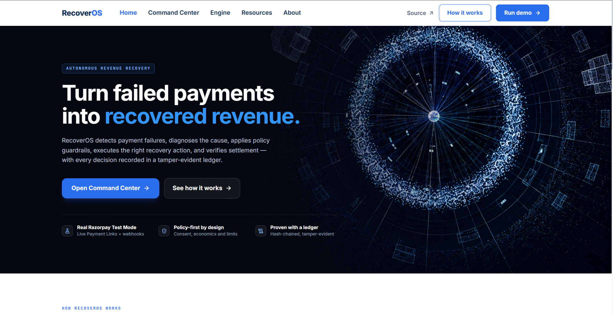
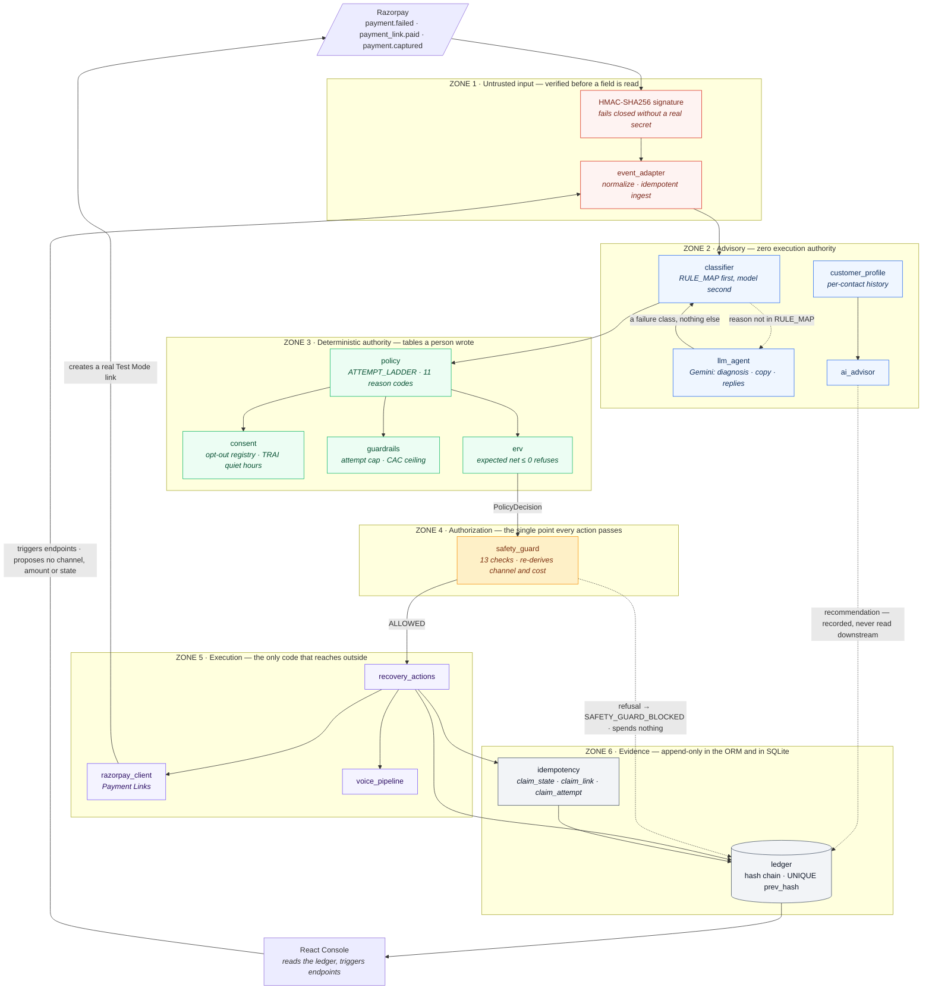

<div align="center">

# RecoverOS

### A revenue recovery agent that can prove what it did, what it spent, and why it stopped.

[](#)
[](#tests)
[](#verify-every-claim-in-60-seconds)
[](#)
[](#)
[](#)
[](https://github.com/RahulH007)



**[Verify the claims](#verify-every-claim-in-60-seconds)** · **[The flow](#the-end-to-end-flow)** · **[AI vs policy](#ai-advises-policy-decides)** · **[Safety Guard](#the-safety-guard)** · **[ERV](#expected-recovery-value)** · **[Architecture](#architecture)** · **[Trust boundaries](#trust-boundary-matrix)** · **[What is not built](#not-built-yet)**

<sub>Original work of **Rahul Hongekar** · [github.com/RahulH007](https://github.com/RahulH007) · Razorpay Buildathon, Track 03 · see [NOTICE](NOTICE.md)</sub>

</div>

---

## The pitch, in one paragraph

Every recovery tool tells you how much it recovered. Ask three follow-up questions and they go quiet: *How much of that did you actually cause?* *What did you spend to get it?* *Why did you stop contacting this customer?*

In India that last question is not a product question. It is a TRAI question, a DLT consent question, and the question a merchant's compliance team asks before letting you near their customer list.

**RecoverOS answers all three, and lets you check the answers yourself.** Every action, every rupee, and every decision *not* to act is written into a tamper-evident hash chain. A holdout group is never contacted, so recovery the system caused can be separated from recovery that would have happened anyway.

> Recovery without proof is spam with a dashboard.

---

## Track 03: the problem, and this solution

**Track 03 — AI Revenue Recovery.** *Find revenue that's slipping away and win it back.* The judging bar: **show measured money recovered across a batch, with compliant escalation, stopping rules, and an audit trail.**

Payment success rates in India sit between **75% and 92%** depending on rail and platform — so 8 to 25 of every 100 attempted transactions drop. Industry estimates put the resulting merchant loss at roughly **₹25,000 crore (about $3bn) a year**.

| | |
|---|---|
| **Technical declines dominate** | Timeouts, gateway congestion and bank downtime — the customer *has* the money and the network fails. These are the most recoverable failures, and the ones most likely to recover on their own. |
| **Failure compounds into churn** | An estimated 40–60% of consumers who hit a checkout failure abandon the cart entirely and do not return, so the loss is lifetime value, not one transaction. |
| **Downtime is expensive by the hour** | Redseer's Fintech Infrastructure Report puts a single hour of outage at up to **₹35 crore** in lost GMV and churn for a large fintech. |
| **Regulation raised the floor** | RBI's e-mandate rules require additional factor authentication for recurring payments above ₹15,000, pushing failure rates past 20% on some subscription platforms. |

Two things follow, and they shape the whole design.

**Most of that money is not equally recoverable.** Technical declines have a high natural recovery rate — the bank comes back, the customer retries. Chasing them aggressively spends real money on revenue that was already arriving. That is why this project measures against a holdout instead of reporting gross recovery, and why every attempt is priced before it is made.

**Recovery is a compliance surface, not just a growth lever.** Every recovery attempt is an outbound contact governed by TRAI and DLT consent rules. A system that recovers well but cannot show *when it stopped and why* is not deployable, whatever its recovery rate.

<sub>The figures above are industry estimates, attributed where a source is named. Everything else in this document is produced by a command in this repository.</sub>

---

## Key features

| | |
|---|---|
| **Tamper-evident ledger** | Every action, refusal and rupee on a hash chain with UNIQUE `prev_hash`. Append-only in the ORM *and* in SQLite triggers. |
| **Deterministic policy ladder** | Eleven reason codes. Escalation per failure class. Attempt cap, CAC ceiling, consent, quiet hours — every stop recorded. |
| **AI advisory, zero execution authority** | The model diagnoses. It cannot name a channel, an amount, a state or an API call. Four independent mechanisms enforce that. |
| **Safety Guard** | Thirteen checks at the single point every action must pass through. Re-derives channel and cost from code, not from what it is handed. |
| **Expected Recovery Value** | Prices each candidate attempt against *observed* success on that channel, for that customer. Refuses at break-even. |
| **Customer personalization** | Per-contact history: which channel actually recovered, which method they paid by, when they pay. Never invented — insufficient history says so. |
| **Real Razorpay Test Mode** | Payment Links created, signed webhooks verified, settlement correlated through a row this system wrote. |
| **Exactly-once under duplicates** | Atomic claims on state, links and attempts. Two workers on one record send one message. |
| **Cohort-scoped economics** | Revenue, cost, ROI and lift computed over one named population — batch, live, or all. |
| **Per-intervention attribution** | Which action recovered how much, at what cost, with what net return. |

---

## Verify every claim in 60 seconds

No API keys. No network. No frontend.

```bash
python -m venv venv && venv/Scripts/activate    # macOS/Linux: source venv/bin/activate
pip install -r backend/requirements.txt
cd backend

python -m app.tools.run_demo         # seeded batch -> a receipt
python -m app.tools.verify_ledger    # walks the chain, exits non-zero if broken
python -m app.tools.tamper_demo      # edits a cost in the DB, watch it get caught
python -m app.tools.run_measurement  # incremental lift with a 95% CI
python -m app.tools.run_tick --dry-run   # what the recovery loop would do next
python -m pytest tests/ -q           # 632 tests
```

<sub>A `Makefile` wraps these as `make demo`, `make verify-ledger`, `make tamper-demo`, `make measure`, `make test`, `make llm-activity`, `make refresh-llm-cache`. Python is the primary interface because `make` is absent from a default Windows install.</sub>

### `run_demo` — run it as often as you like, the output never changes

`run_demo` builds its own throwaway database each time, so it never touches your working data. Every figure below, **the ledger head hash included**, is identical on every run and every machine.

```text
  Seed                : 20260825  (deterministic)
  Records             : 65
  Attempt cap         : 3 per payment
  Cost ceiling        : 15% of payment value
  Assumed margin      : 20%
  Holdout             : 20% of contacts, never contacted
------------------------------------------------------------------------
  OUTCOME
    treated           :  48 records,  23 recovered  (47.9%)
    control           :  12 records,   0 recovered  (0.0%)
    attributable      :  23 payments worth Rs 106,191.00
    channel spend     : Rs 31.50
------------------------------------------------------------------------
  WHY WE STOPPED
      1  RETRY_CAP_REACHED          2  CONSENT_WITHDRAWN
      1  CAC_CEILING                2  QUIET_HOURS_DEFERRED
      1  NEGATIVE_EXPECTED_VALUE    5  HARD_DECLINE
      2  ESCALATED_TO_HUMAN        13  LADDER_EXHAUSTED
     12  HOLDOUT_CONTROL            1  REPLY_DISPUTE
      2  REPLY_WILL_PAY
------------------------------------------------------------------------
  AI ACTIVITY
    model calls       : 56   (replayed from the recorded cache)
    classified by     : 57 rule engine / 8 llm agent
    tokens in / out   : 13012 / 4200
    copy rejected     : 8
------------------------------------------------------------------------
  LEDGER
    entries           : 462
    chain             : VALID
    head              : d40aefe8d2bc79ff3c14e27c31f211375edc25edb26848c122baf70ea7462fa0
```

Read the receipt's `47.9%` carefully: that is the **treated** arm. Across the whole batch it is **23 of 65, 35.4%** — and the difference between those two numbers is the point of holding a control arm out at all.

The full run is committed at [`results/demo_run.txt`](results/demo_run.txt).

### The same batch, through the dashboard

`GET /api/metrics/dashboard?scope=batch` over the demo database, which is where cost, ROI and per-channel attribution live:

```text
  total records        65            recovered            23  (35.4%)
  total GMV            Rs 270,693.50 recovered GMV        Rs 106,191.00
  intervention spend   Rs 31.50      net recovery         Rs 106,159.50
  cost per recovery    Rs 1.36       arm coverage         60 with / 5 without

  RECOVERY BY INTERVENTION
  Intervention      Attempts  Recovered   Rate   Rs Recovered    Cost        Net Rs      ROI
  silent_retry            23         13  92.9%   Rs 55,192.00      0p  Rs 55,192.00        -
  whatsapp_link           35          6  20.0%   Rs 15,699.00   1750p  Rs 15,681.50     896x
  human_queue              4          1  25.0%   Rs 15,000.00      0p  Rs 15,000.00        -
  hinglish_voice           4          2  50.0%   Rs 14,800.00    800p  Rs 14,792.00   1,849x
  upi_resequence          12          1   8.3%    Rs 5,500.00    600p   Rs 5,494.00     916x

  spend accounted for: 3150p of 3150p (residual 0p) · 23 of 23 recoveries attributed
```

Two things worth reading twice. **Silent retry recovered the most money and cost nothing** — but it only ever runs on `TRANSIENT_TECHNICAL`, the class most likely to recover on its own, so that row is a selection effect and not a recommendation. And **every paisa is accounted for**: the per-channel costs and the headline cost are two independent walks of the ledger, and the residual between them is zero.

<sub>These figures come from a `DEMO_MODE=true` run, which replays `backend/data/llm_cache.json` and makes no network call. Eight WhatsApp messages have no recorded response and fall back to their deterministic template — that is the `copy rejected` line, and it is why the run stays reproducible.</sub>

### `tamper_demo` — the part worth watching

It opens the SQLite file **directly, outside the application**, and changes a recovery cost from 50 paise to 0, hiding money that was spent. Then it re-verifies.

```text
  RESULT: TAMPERING DETECTED
    broken at sequence : 105
    entries verified   : 105 (before the break)
    reason             : Content tampered at sequence 105 (payment pay_AF016p4bC8d,
                         action WHATSAPP_LINK_SENT): stored hash 564169bf97be26df...
                         but content hashes to 68bf9240c7809c49...
```

It names the row, the payment, the action, and both hashes. The edit only got that far because the script drops its own append-only triggers first — with them in place, SQLite itself rejects the `UPDATE`.

---

## The end-to-end flow

```mermaid
flowchart LR
    A[Razorpay<br/>webhook] --> B[Diagnose<br/><i>rules, then model</i>]
    B --> C[Advisory<br/><i>AI + customer context</i>]
    C --> D[Policy<br/><i>deterministic ladder</i>]
    D --> E[ERV<br/><i>economic gate</i>]
    E --> F[Safety Guard<br/><i>authorization</i>]
    F --> G[Recovery<br/><i>the action</i>]
    G --> H[Settlement<br/><i>signed webhook</i>]
    H --> I[Metrics + Ledger]

    style C fill:#EFF6FF,stroke:#2B6DEF
    style D fill:#ECFDF3,stroke:#12B76A
    style E fill:#ECFDF3,stroke:#12B76A
    style F fill:#FEF0C7,stroke:#F79009
```



Each arrow narrows what the next stage may do. Diagnosis produces a failure class and nothing else. The advisory produces a recommendation that can be ignored. Policy turns a class into a channel, an attempt number and a cost, from tables written in code. ERV asks whether that specific attempt is worth its cost. The guard re-derives channel and cost from those same tables and refuses anything that does not match. The executor performs exactly what it was authorised to perform.

Full detail — every module, every check, every failure mode — is in **[documentation/ARCHITECTURE.md](documentation/ARCHITECTURE.md)**.

---

## Architecture

The system is drawn as trust zones rather than as a service diagram, because
the interesting property is not what talks to what — it is **what each layer is
permitted to decide**. Authority narrows left to right and never widens.



**Read the two dotted arrows out of Zone 2 and Zone 4.** They are the whole
design. The advisory's output goes to the ledger and the console — it is
*recorded*, and it is never an input to the decision. The guard's refusal is
also an arrow: a block is written down with the check that fired, rather than
being a silence.

### Trust Boundary Matrix

| Component | Role | Execution authority | Enforced by |
|---|---|---|---|
| **Razorpay payload** | External event | **None until verified.** HMAC-SHA256 over the exact bytes, checked before a field is read. Webhook `notes` are attacker-supplied: a match adds confidence, a mismatch disqualifies, absence proves nothing. | Fails closed outside demo mode — a missing or placeholder secret rejects every webhook |
| **`llm_agent`** | Diagnoses failures the rules cannot map; writes WhatsApp copy and voice scripts; reads inbound replies | **None.** Returns one of five failure classes and text. Cannot name a channel, an amount, a state, or an API call. | Unparseable output or low confidence degrades to `HARD_DECLINE`, whose ladder is empty |
| **`ai_advisor`** · **`customer_profile`** | Recommends, with per-contact history | **None.** The recommendation is written to the ledger and shown in the UI. No downstream module reads it. | AST test parses each module and asserts it imports no `recovery_actions`, `razorpay_client`, `voice_pipeline`, `settlement`, `httpx` or `requests` |
| **`classifier`** | Error code → failure class | **Routing only.** `RULE_MAP` first; the model path exists only for codes the table does not hold. | An unmapped *live* reason is ingested and **held** — no action, no spend |
| **`policy`** | Act or refuse · which channel · which attempt · what cost | **Absolute.** Channel is a lookup in `ATTEMPT_LADDER`, never generated. Eleven reason codes, cheapest first, first refusal wins. | Re-consulted before *every* attempt, so the cap and the ceiling bind against accumulated spend |
| **`consent`** · **`guardrails`** | Suppression registry · TRAI quiet hours · attempt cap · CAC ceiling | **Veto only.** Can stop an action; can never start one. | Suppression is keyed on the normalized phone, so it crosses every payment from that contact |
| **`erv`** | Is this specific attempt worth its cost | **Veto only.** Break-even is a refusal, not an approval. | Evaluated **last**, so a compliance stop is never reported as an economic one |
| **`safety_guard`** | Final authorization | **Absolute veto.** Thirteen checks. Re-derives channel and cost from policy's own tables rather than trusting what it was handed. First check is `isinstance(decision, PolicyDecision)` — a model's raw dict is rejected before one field is read. | Deliberately does **not** import `recovery_actions`; a guard must not depend on the thing it guards |
| **`idempotency`** | Exactly-once under duplicates and races | **Absolute.** Conditional `UPDATE … WHERE` on state and link; `UNIQUE(payment_id, batch_key, attempt_number)` on attempts. | The database decides who wins; `transition_state` returns whether *this* caller made the transition |
| **`recovery_actions`** · **`razorpay_client`** · **`voice_pipeline`** | Physical dispatch — the only code that reaches a customer, a bank, or Razorpay | **Execution only.** Performs exactly what the guard authorised, and reads no recommendation. A record whose advisory says `hinglish_voice` at 99% confidence still gets `whatsapp_link` if that is the rung. | Live path gated on `source = razorpay_webhook` *and* `DEMO_MODE`, so the synthetic batch cannot reach the network even with real credentials loaded |
| **`ledger`** | Evidence | **None, by construction.** Append-only. Nothing in the system can update or delete an entry. | SQLAlchemy events *and* SQLite `BEFORE UPDATE` / `BEFORE DELETE` triggers; `UNIQUE prev_hash` prevents forks |
| **React console** | Operator console | **Trigger only.** Invokes endpoints. Cannot propose a channel, an amount, or a state transition. | Every drill it fires — opt-out, fraud halt — runs the same policy path and is ledgered with its own actor |

The four independent mechanisms that keep Zone 2 powerless are described, with
the test that breaks each one, in [AI advises, policy decides](#ai-advises-policy-decides).

---

## AI advises, policy decides

This is the distinction the whole design turns on.

**What the model does.** It reads a bank error string the rule engine does not recognise and returns a failure class, an explanation, a suggested action and a confidence. It writes per-customer WhatsApp copy and Hinglish voice scripts. It reads inbound customer replies.

**What the model cannot do.** Name a channel. Name an amount. Move a state. Call an API. There is no parameter anywhere downstream through which such a thing could arrive.

Four independent mechanisms, each separately tested:

1. **The model never names a channel.** It names one of five failure classes; the channel is looked up in `policy.ATTEMPT_LADDER`, a table a person wrote. `HARD_DECLINE`'s ladder is empty, so a compliance halt recommends nothing at all.
2. **The advisory modules cannot import an executor.** `ai_advisor.py`, `customer_profile.py` and `erv.py` import no `recovery_actions`, no `razorpay_client`, no `voice_pipeline`, no `settlement`, no HTTP client. Enforced by tests that parse each module's own AST.
3. **The Safety Guard refuses by type.** Its first check is `isinstance(decision, PolicyDecision)`. A recommendation — or the model's raw JSON handed over as a dict — is rejected before one field is read.
4. **The executor never reads a recommendation.** A record whose advisory recommends `hinglish_voice` at 99% confidence still gets `whatsapp_link`, because that is what the ladder says. That exact case is a test.

**The model can add a stop, never remove one.** Low confidence, unparseable output, or an invented sixth class all degrade to `HARD_DECLINE` — which has no ladder and therefore no possible action.

**The model writes the words, never the numbers.** Every amount in generated copy must equal the record's amount and every link must be one we created; a failure sends the deterministic template and writes `LLM_OUTPUT_REJECTED` to the chain.

### Why this customer, why this channel, why now

The per-contact profile is arithmetic over that customer's own records — keyed on the normalized phone the consent registry already uses as identity, so `+91 98123-45678` and `9812345678` are one history. It reports which channel actually recovered money from them, which method they paid by, what keeps failing, and when past recoveries settled.

**Nothing is invented.** Thresholds are named constants. One resolved payment is `thin`, not a preference. Three ignored WhatsApp links with no recovery names *no* effective channel — that is a habit of ours, not a preference of theirs. A new contact gets one line: *"No prior payments from this contact in this system."*

The recommendation may name a channel the ladder will not use. When it does, the card says so and the executor follows the ladder — an advisory nobody can override is not an advisory.

---

## The Safety Guard

The single point every action must pass through, sitting between a policy decision and anything that can reach a customer, a bank, or Razorpay.

Thirteen checks, first refusal wins: provenance, source, channel allowlist, classification, class/channel fit, state, unmapped live reason, held-for-review, diagnosis confidence, attempt limit, stale decision, cost mismatch, spend limit.

It **re-derives** channel and cost from the same deterministic tables policy used rather than trusting what it is handed, and it deliberately does not import `recovery_actions` — the guard must not depend on the thing it guards.

**A refusal is an outcome, not a silence.** It writes `SAFETY_GUARD_BLOCKED` (actor `safety_guard`, cost 0), makes no state transition, calls nothing, spends nothing, and leaves the record where it was so a person can pick it up.

### Fail-closed behaviour

| Failure | Behaviour |
|---|---|
| Missing or placeholder webhook secret | request **rejected** outside demo mode |
| Live error code not in `RULE_MAP` | ingested, classified, **held** — no action, no spend |
| Model call raises | escalated to a human; nothing invented to fill the gap |
| Model output unparseable | zero confidence → `HARD_DECLINE` → empty ladder → no action |
| Loopback callback URL | Payment Link **not created**; the action stops rather than sending a demo URL to a live customer |
| Settlement amount or currency mismatch | held and ledgered; the record is unchanged |
| Two workers on one record | one claim wins; the other sends nothing |

The pattern throughout: the expensive mistake is contacting someone we should not have, or spending money we cannot account for. Every ambiguous case resolves toward doing nothing and writing down why.

---

## The stopping rules

Eleven reason codes, evaluated cheapest-and-most-fundamental first, first refusal wins — so the recorded reason is the deepest one rather than whichever was evaluated last.

```
HARD_DECLINE            compliance halt — never contact, at any cost
HOLDOUT_CONTROL         the control arm is observed, never treated
PROMISE_TO_PAY_PENDING  a stated date defers; it does not stop
LADDER_EXHAUSTED        this class's escalation ladder is finished
RETRY_CAP_REACHED       three attempts in this batch
CAC_CEILING             spend would exceed 15% of the payment
NEGATIVE_EXPECTED_VALUE cost beats the class-average margin
CONSENT_WITHDRAWN       opt-out registry
QUIET_HOURS_DEFERRED    TRAI 21:00–09:00 IST, voice only
ECONOMICALLY_UNVIABLE   ERV — this attempt is not worth its cost
PROCEED
```

Three refusals leave the record **open** rather than closing it — a quiet-hours deferral, a holdout observation, and a stated promise to pay are pauses, not stops. The recovery tick delivers the "later".

The escalation ladder, per failure class:

| Class | Rungs | Cost |
|---|---|---|
| `TRANSIENT_TECHNICAL` | `silent_retry` × 5 | 0p |
| `AUTH_FRICTION` | `whatsapp_link` × 2 | 50p |
| `MANDATE_BALANCE` | `upi_resequence` → `whatsapp_link` | 50p |
| `B2B_RECEIVABLE` | `whatsapp_link` → `hinglish_voice` → `human_queue` | 50p → 200p → 0p |
| `HARD_DECLINE` | *(empty)* | — |

---

## Expected Recovery Value

Before an intervention executes, is it economically worth attempting?

```
expected_value = amount × probability
expected_net   = expected_value − action cost
expected_net <= 0  →  ECONOMICALLY_UNVIABLE
```

Break-even is a refusal, not an approval: an attempt that only matches its own cost in expectation has spent real money and real customer patience for nothing.

**The probability comes from history that already exists**, most specific first, and is always labelled:

| Source | Threshold |
|---|---|
| `customer_history` | ≥ 3 attempts on this channel for this contact |
| `channel_history` | ≥ 20 attempts on this channel across all records |
| `default_estimate` | otherwise — the config per-class rate, marked *not observed* |

No model, no training, no new service. Both history sources reuse the same attribution the dashboard reports.

A worked example, in the units the system actually uses — a WhatsApp send costs **50 paise**, not ₹50:

```
Payment: Rs 5,000.00
Action: WhatsApp Link
Estimated success: 62%
Expected recovery: Rs 3,100.00
Cost: Rs 0.50
Expected net: Rs 3,099.50
Decision: PROCEED
```

And the case ERV exists for — four links to this contact, none ever paid:

```
Estimated success: 0%
Expected net: -Rs 0.50
Decision: STOP - ECONOMICALLY UNVIABLE
Basis: 0 of 4 previous whatsapp_link attempts on this contact were recovered.
```

The flat per-class rate says `AUTH_FRICTION` recovers 40% of the time, so it would approve a fifth message forever. ERV is evaluated **last**, after every other gate, so a compliance stop is never reported as an economic one.

---

## Razorpay Payment Links and settlement

Two events can settle the same rupee, and Razorpay emits both.

| Event | Correlation |
|---|---|
| `payment_link.paid` | names the link; we hold a row proving which record it was created for. **The reliable path.** |
| `payment.captured` | direct match on payment id first; falls back to link correlation only when the payload genuinely contains a link id |

The `RazorpayPaymentLink` row is the trust anchor. Its `recovery_action_id` is the **`entry_hash` of the ledger entry that created the link**, so the correlation is only valid while that entry's content is unaltered.

`_extract_payment_link_id` returns `None` rather than reconstructing an id. Guessing which link a captured payment belongs to — by amount, by recency, by anything — would let one customer's payment recover a different customer's record, which is the worst failure this system could have.

Webhook `notes` are attacker-supplied from this system's point of view: a match adds confidence, a mismatch is disqualifying, and absence proves nothing.

**The payer's browser landing page changes no state.** Its parameters live in a URL the payer can edit; settlement happens on the signed webhook, over a channel the payer cannot forge.

### Live Razorpay evidence

The whole loop has been run against Razorpay Test Mode, not described. One payment, end to end, every id verifiable against the account:

```
signed payment.failed  pay_LIVE4E4D1A964440   Rs 450.00, authentication_failed
  -> CLASSIFIED_AUTH_FRICTION      rule_engine    (no model call)
  -> STATE_DIAGNOSED_TO_INTERVENING policy_engine  attempt 1 of 2, 50p of a 6750p ceiling
  -> WHATSAPP_LINK_SENT            50p            https://rzp.io/rzp/oAGfiY6A
  -> Payment Link plink_TUppWD0wkTH8ka created at Razorpay
     notes.recoveros_payment_id = pay_LIVE4E4D1A964440
  -> paid in Test Mode -> new payment pay_TUprzIZ27o4lR6, captured
  -> signed payment_link.paid -> STATE_INTERVENING_TO_RECOVERED
```

Razorpay delivered three events for that payment inside three seconds — `payment.authorized`, then `payment.captured` (carrying the *new* payment id and no link id, so it settles nothing), then `payment_link.paid`. **The ledger holds exactly one recovery transition.**

---

## Idempotency and concurrency

Razorpay retries delivery on any non-2xx and on a timeout, fires two event types for one rupee, and the recovery tick is an endpoint anyone can call twice. Every protection used to be read-then-write — correct in a single thread, atomic nowhere.

| Primitive | Mechanism | Closes |
|---|---|---|
| `claim_state` | conditional `UPDATE … WHERE recovery_state IN (…)` | two RECOVERED transitions for one payment |
| `claim_link` | the same, on the link's settled flag | two deliveries both settling one link |
| `claim_attempt` | `INSERT` against `UNIQUE(payment_id, batch_key, attempt_number)` | two workers both messaging one customer |

`transition_state` returns whether **this** caller made the transition, and settlement checks it — answering "recovered" for a transition another delivery made is how a duplicate webhook becomes a duplicate figure downstream.

**Retry after partial failure** is decided by whether the customer was actually contacted: if nothing was sent, the claim is released and the rung is retried; if a send is already on the ledger, the claim is kept, because releasing it would send a second copy of the same message.

---

## The recovery tick

The live path calls `execute_recovery` once per webhook and never again — so without something driving it, the ladder stops at rung one, the attempt cap is unreachable, and a quiet-hours deferral is a permanent halt rather than a pause.

```bash
python -m app.tools.run_tick --dry-run   # default: reports, changes nothing
python -m app.tools.run_tick --execute   # acts
curl -X POST 'localhost:8000/api/recovery/tick?dry_run=false'
```

`dry_run` defaults to **true** in both the CLI and the endpoint: a misconfigured caller that forgets the flag should report what it would do rather than message customers. A dry run makes zero writes and zero external calls, and returns the identical selection a real tick would act on.

It skips records that are held for review, that still have an unexpired payable link, or that were touched inside the 30-minute follow-up window. One record raising does not abort the pass.

---

## Measuring money honestly

**Cohort scoping.** `GET /api/metrics/dashboard?scope=batch|live|all` — revenue, recovery rate, cost, ROI, class breakdown and lift are all computed over **one** population, and the reading says which. Before this the endpoint summed every record ever stored while scoping cost to non-null batch ids, so a live recovery's GMV counted as revenue and its spend did not count as cost.

**Lift, not gross recovery.** A holdout arm is never contacted. `arm_coverage` reports how much of the cohort carries an arm at all, because lift is computed from `arm` and only the simulator assigns it.

**Per-intervention economics.** Which action recovered how much, at what cost, with what net return. The attribution rule is deliberately narrow:

> A recovery is credited to the **last attempt made before** the record transitioned to RECOVERED — and to **nothing at all** when no attempt preceded it.

Both halves matter. Crediting the last attempt lets an escalation ladder report honestly. Crediting nothing keeps the holdout honest: the control arm is never contacted and some of it pays anyway, and those rupees belong to no channel.

The per-channel costs and the headline cost come from **two independent walks** of the ledger, and the response reports both plus the residual — so their agreement is evidence rather than a tautology.

---

## Configuration

All settings are environment variables, read in `backend/app/config.py`. Start from `backend/.env.example`.

| Variable | Default | Purpose |
|---|---|---|
| `DEMO_MODE` | `true` | `true` replays recorded model responses and blocks the live Razorpay path |
| `DATABASE_URL` | `sqlite:///./recoveros.db` | SQLAlchemy URL |
| `RAZORPAY_KEY_ID` | — | Test Mode key id |
| `RAZORPAY_KEY_SECRET` | — | Test Mode key secret |
| `RAZORPAY_WEBHOOK_SECRET` | — | HMAC secret; **missing or placeholder rejects every webhook when `DEMO_MODE=false`** |
| `PUBLIC_BASE_URL` | `http://localhost:8000` | builds the Payment Link callback; a loopback host is refused before a live link is created |
| `GEMINI_API_KEY` | — | required only to record new cache entries |
| `SARVAM_API_KEY` | — | Hinglish TTS; mocked when absent |
| `MERCHANT_MARGIN_PERCENT` | `20` | assumed gross margin; drives the margin-based EV check |
| `HOLDOUT_PERCENT` | `20` | share of contacts never contacted |
| `RECOVEROS_SEED` | `20260825` | deterministic simulation seed |

System constants live in `config.py` rather than the environment because they are policy, not deployment: `MAX_RETRIES = 3`, `CAC_CEILING_PERCENT = 15`, `SETTLEMENT_TIMEOUT_MINUTES = 30`, `CONFIDENCE_THRESHOLD = 0.7`, quiet hours 21:00–09:00 IST, and the per-channel costs in paise.

### Test Mode vs Demo Mode — read this before running anything

These are **two different switches** and confusing them is the one way to spend real money or leak real contact.

| | `DEMO_MODE=true` | `DEMO_MODE=false` |
|---|---|---|
| Gemini | replays `data/llm_cache.json`; a miss raises rather than calling | **real API calls, real cost** |
| Razorpay | no client is built; demo placeholder URLs | **real Test Mode Payment Links created** |
| Sarvam TTS | mocked | **real synthesis, real cost** |
| Webhook signature | accepted without a secret, for local work | **fails closed without a real secret** |

**Razorpay Test Mode is still real API traffic.** No live money moves, but links are created against the account and appear in the dashboard. The source gate means only records ingested from a signed webhook (`source = razorpay_webhook`) can reach it — the synthetic batch cannot, even with real credentials loaded.

**The test suite is safe either way.** Each integration is locked three times over — the flag that selects the live path, the function that performs the call, and the SDK or transport underneath — so `pytest` makes no external call even with `DEMO_MODE=false` and real credentials in `.env`. See `tests/test_external_isolation.py`.

---

## API

| Method | Endpoint | Purpose |
|---|---|---|
| `GET` | `/health` | Health check |
| `POST` | `/api/batch/run` | Start a batch run |
| `GET` | `/api/batch/{batch_id}/status` | Progress and per-class breakdown |
| `GET` | `/api/metrics/dashboard` | Cohort metrics, interventions, lift, AI insight, ledger head |
| `GET` | `/api/ledger/verify` | Walk and verify the whole chain |
| `GET` | `/api/ledger/head` | Current head hash and entry count |
| `GET` | `/api/audit/{payment_id}` | Audit trail, AI recommendation, customer insight |
| `GET` | `/api/audit/{payment_id}/verify` | Recompute that payment's entry hashes |
| `GET` | `/api/llm/activity` | Model calls, tokens, latency, rejections, rule/model split |
| `GET` | `/api/recovery/{payment_id}` | Record, audit trail, AI recommendation, customer insight |
| `POST` | `/api/recovery/tick` | Advance every live recovery that is due (`dry_run` defaults true) |
| `POST` | `/api/recovery/{payment_id}/opt-out` | Withdraw consent for this contact |
| `POST` | `/api/recovery/{payment_id}/reply` | Inbound customer message; the model reads it, policy acts |
| `POST` | `/api/recovery/{payment_id}/quarantine` | Halt on a fraud signal, recorded with `actor="system"` |
| `POST` | `/api/recovery/{payment_id}/settle` | Simulate settlement |
| `POST` | `/api/recovery/{payment_id}/dtmf` | Voice keypad response |
| `GET` | `/api/voice/{payment_id}` | Hinglish voice script |
| `POST` | `/api/webhooks/razorpay` | Signed webhook ingestion |
| `GET` | `/api/webhooks/razorpay` | Payer landing page — **changes no state** |
| `WS` | `/ws/dashboard` | Live state transitions |

---

## Running the full application

```bash
# Terminal 1 — API on :8000
cd backend && uvicorn app.main:app --reload

# Terminal 2 — dashboard on :5173
cd frontend && npm install && npm run dev
```

The dashboard's Command Center reads top to bottom as one argument: what revenue is at risk, what came back, which intervention brought it back, what the model made of the hard cases, where each record sits — and one click into any record, why *that* customer, why *that* channel, why now.

---

## Tests

**632 tests.**

```bash
cd backend && python -m pytest tests/ -q
```

| Module | Covers |
|---|---|
| `test_ledger.py` | Golden preimage, field-shift collisions, tamper and deletion detection, append-only enforcement, fork prevention, four-writer concurrency |
| `test_safety_guard.py` | All thirteen checks, provenance by type, live/synthetic scoping, refusal is ledgered |
| `test_concurrency_idempotency.py` | Duplicate and racing webhooks, two workers, both settlement events together, retry after partial failure, exactly-once revenue |
| `test_erv.py` | Expected value arithmetic, the break-even boundary, probability sources, every existing refusal still winning |
| `test_customer_profile.py` | Strong / mixed / absent history, insufficient data stated, policy overriding the recommendation |
| `test_ai_advisory.py` | High and low confidence, malformed output, unmapped reason, and that a recommendation alone executes nothing |
| `test_intervention_economics.py` | Per-channel attribution, the recovery cutoff, unattributed recoveries, re-run protection |
| `test_metrics_cohorts.py` | Batch / live / all isolation, cost belonging to the records reported |
| `test_recovery_tick.py` | Selection, skip reasons, dry run writing nothing, deferral resuming |
| `test_external_isolation.py` | Three independent locks per integration; the suite cannot reach the network |
| `test_policy.py` | Every reason code, ladder escalation, deferral versus stop |
| `test_consent.py` | Phone normalisation, cross-payment suppression, quiet hours, no raw PII stored |
| `test_outcome_engine.py` | Draw reproducibility, order independence, attribution, holdout stratification |
| *and more* | Classifier, guardrails, diagnosis, inbound replies, settlement, webhooks, batch, state machine, WebSocket, attribution |

Beyond count, three techniques carry the weight: **mutation testing** (break one invariant, confirm the suite catches it — every guarantee in this README has been mutated), **deterministic race reproduction** (no sleeps; one worker held inside its action while another decides beside it), and **structural assertions** (AST parses proving advisory modules cannot import an executor).

---

## What is real, and what is not

| Component | Status |
|---|---|
| Hash chain, verification, tamper detection | **Real** — runs on actual data, covered by tests |
| Append-only enforcement | **Real** — SQLAlchemy events plus SQLite triggers |
| Policy engine, stopping rules, reason codes | **Real** — every code fires in a normal run |
| Safety Guard, ERV, idempotency claims | **Real** — enforced on every execution path |
| Consent registry, quiet hours, suppression | **Real** — enforced before every outbound |
| Customer profile and AI advisory | **Real** — read from stored records and the ledger |
| Classification, holdout assignment, lift arithmetic | **Real** — deterministic and stratified |
| Razorpay payment links and settlement webhooks | **Real** — Test Mode, end to end |
| Gemini diagnosis, reply reading, message writing | **Real** — recorded responses, replayed deterministically |
| Customer outcomes in the batch | *Simulated* — each record carries a stated counterfactual |
| WhatsApp sends, voice calls, TTS delivery | *Simulated* — nothing leaves the machine |

### Not built yet

- **Customer messaging is still simulated.** The Payment Link is real and payable; the WhatsApp message carrying it is composed and ledgered, not delivered.
- **No telephony.** Voice audio is synthesized or mocked; no call is placed.
- **No scheduler process.** The recovery tick is an endpoint and a CLI. Point cron at it.
- **Demo mode replays recorded Gemini responses.** A live model returns different text and a different latency every time, and both land in the hash preimage — so a demo that called Gemini directly could never reproduce its own head hash.
- **SQLite, single node.** WAL and a busy timeout are configured; production needs Postgres.
- **No authentication on the dashboard API**, and no multi-tenant isolation.
- **The "Ask RAY" widget is scripted**, not a live model call.

Known defects and internal rough edges are listed in [documentation/ARCHITECTURE.md § Known limitations](documentation/ARCHITECTURE.md#21-known-limitations) rather than hidden.

---

## Why RecoverOS is different

Most recovery tools optimise one number and show you that number. This one is built around the three questions that follow it.

**It can prove what it did.** Not a log — a hash chain with UNIQUE `prev_hash`, append-only in the ORM and in the database, with a demo that tampers with the file and gets caught. Every claim in this README is re-checkable by a command in it.

**It records restraint as carefully as action.** Eleven reason codes, every refusal on the chain with the gate that fired. "We did not contact this customer, here is why" is a first-class output, because in India that is the question that decides whether the system is deployable at all.

**It separates advice from authority.** The model is genuinely useful — it diagnoses failures the rule engine cannot — and it holds no power whatsoever. Four independent mechanisms enforce that, and each is tested by breaking it and watching the suite fail.

**It prices the attempt before making it.** Not a class average: what *this* channel has actually recovered from *this* customer. And when the history is too thin to say, it says so instead of guessing.

**It measures against a holdout.** Gross recovery flatters every system in this category. Only the difference against an untreated arm is attributable, and the dashboard reports how much of the cohort even carries an arm.

**It survives the real world.** Duplicate webhooks, both settlement events at once, two workers on one record, a crash mid-send. Exactly one message, exactly one recovery, exactly one lot of revenue — enforced by database constraints, not by hoping.

---

## Repository layout

```
backend/
  app/
    ledger.py                  hash chain: canonical preimage, append, verify
    policy.py                  act or refuse, on what channel, when to stop
    erv.py                     expected recovery value of one candidate action
    safety_guard.py            final authorization; 13 checks
    idempotency.py             atomic claims: state, link, attempt
    customer_profile.py        per-contact history -> personalized advisory
    ai_advisor.py              structured AI recommendation, never authorising
    intervention_economics.py  which action recovered how much, at what cost
    recovery_tick.py           advances open live recoveries
    consent.py                 suppression registry, quiet hours
    outcome_engine.py          counterfactual replay, holdout assignment
    guardrails.py              attempt cap, cost ceiling, opt-out detection
    classifier.py              error code -> failure class: rules first, model second
    llm_cache.py               records real Gemini responses, replays deterministically
    llm_agent.py               diagnosis, reply parsing, copy, output guards
    event_adapter.py           signed webhook -> record, idempotently
    settlement.py              payment -> record correlation, exactly-once
    inbound.py                 customer reply -> deterministic consequence
    state_machine.py           lifecycle FSM; routes all writes through the ledger
    recovery_actions.py        channel implementations + execute_recovery
    models.py                  ORM, append-only enforcement
    routes/                    webhooks, batch, recovery, metrics, audit, ledger, llm
    tools/                     run_demo, verify_ledger, tamper_demo, run_measurement,
                               run_tick, refresh_llm_cache, seed_*
  data/                        65-record dataset with stated counterfactuals
                               plus llm_cache.json, the recorded Gemini responses
  tests/                       632 tests
frontend/                      React 19, Vite, Tailwind 4
documentation/ARCHITECTURE.md  full technical architecture
results/                       committed output from the commands above
docs/                          screenshots and earlier architecture notes
```

---

<div align="center">

**Built by [Rahul Hongekar](https://github.com/RahulH007)** for the Razorpay Buildathon, Track 03.

<sub>Every number in this document is produced by a command in it.</sub>

<sub>Copyright (c) 2026 Rahul Hongekar. Published for evaluation; no licence granted. See [NOTICE.md](NOTICE.md).</sub>

</div>
