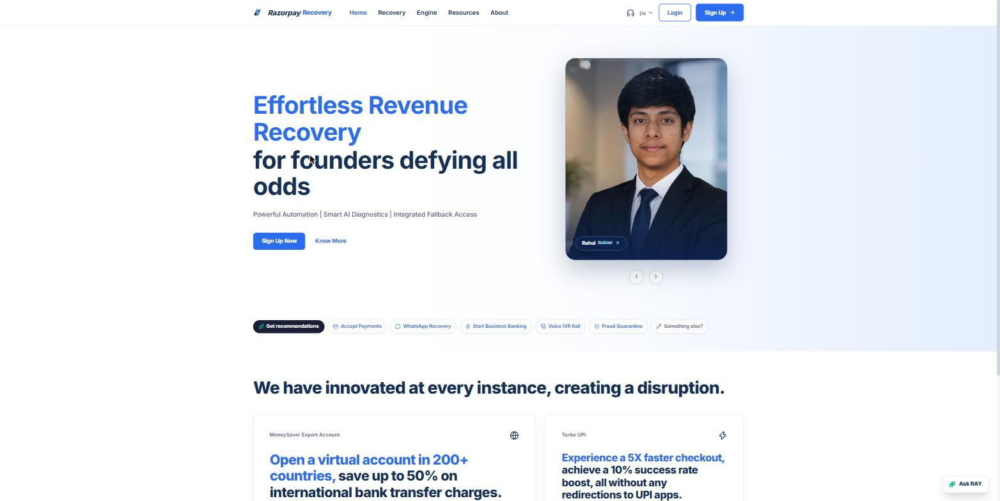
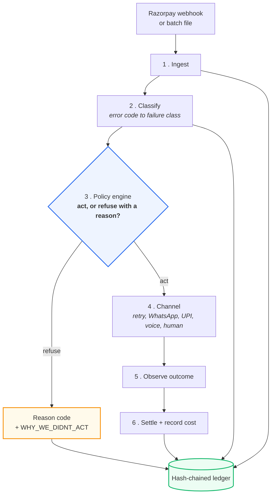
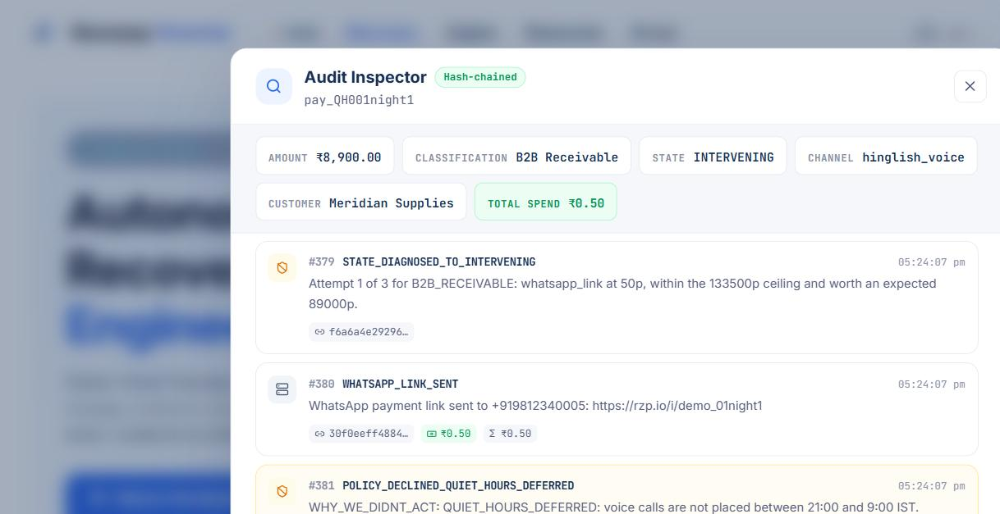
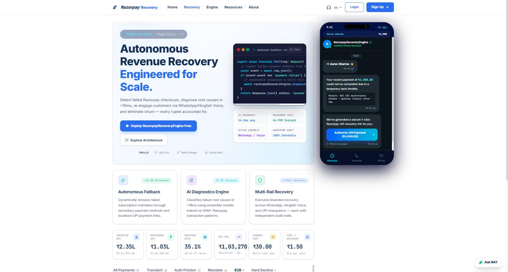

<div align="center">

# RecoverOS

### A revenue recovery agent that can prove what it did, what it spent, and why it stopped.

[](#)
[](#tests)
[](#verify-every-claim-in-60-seconds)
[](#)
[](#)
[](#)



**[Verify the claims](#verify-every-claim-in-60-seconds)** · **[How it works](#how-it-works)** · **[Stopping rules](#the-stopping-rules)** · **[Measurement](#measuring-money-honestly)** · **[What is not built](#not-built-yet)**

</div>

---

## The pitch, in one paragraph

Every recovery tool tells you how much it recovered. Ask three follow-up questions and they go quiet: *How much of that did you actually cause?* *What did you spend to get it?* *Why did you stop contacting this customer?*

In India that last question is not a product question. It is a TRAI question, a DLT consent question, and the question a merchant's compliance team asks before letting you near their customer list.

**RecoverOS answers all three, and lets you check the answers yourself.** Every action, every rupee, and every decision *not* to act is written into a tamper-evident hash chain. A holdout group is never contacted, so recovery the system caused can be separated from recovery that would have happened anyway.

> Recovery without proof is spam with a dashboard.

---

## Why this is worth building

Payment success rates in India sit between **75% and 92%** depending on rail and platform — so 8 to 25 of every 100 attempted transactions drop. Industry estimates put the resulting merchant loss at roughly **₹25,000 crore (about $3bn) a year**.

| | |
|---|---|
| **Technical declines dominate** | Timeouts, gateway congestion and bank downtime — the customer *has* the money and the network fails. These are the most recoverable failures, and the ones most likely to recover on their own. |
| **Failure compounds into churn** | An estimated 40–60% of consumers who hit a checkout failure abandon the cart entirely and do not return, so the loss is lifetime value, not one transaction. |
| **Downtime is expensive by the hour** | Redseer's Fintech Infrastructure Report puts a single hour of outage at up to **₹35 crore** in lost GMV and churn for a large fintech. |
| **Regulation raised the floor** | RBI's e-mandate rules require additional factor authentication for recurring payments above ₹15,000, pushing failure rates past 20% on some subscription platforms. |

Two things follow, and they shape the whole design.

**Most of that money is not equally recoverable.** Technical declines have a high natural recovery rate — the bank comes back, the customer retries. Chasing them aggressively spends real money on revenue that was already arriving. That is why this project measures against a holdout instead of reporting gross recovery.

**Recovery is a compliance surface, not just a growth lever.** Every recovery attempt is an outbound contact governed by TRAI and DLT consent rules. A system that recovers well but cannot show *when it stopped and why* is not deployable, whatever its recovery rate.

<sub>The figures above are industry estimates, attributed where a source is named. **Every other number in this document was produced by a command in this repository** — see below.</sub>

---

## Verify every claim in 60 seconds

No API keys. No network. No frontend.

```bash
python -m venv venv && venv/Scripts/activate    # macOS/Linux: source venv/bin/activate
pip install -r backend/requirements.txt
cd backend

python -m app.tools.run_demo         # seeded batch -> the receipt below
python -m app.tools.verify_ledger    # walks the chain, exits non-zero if broken
python -m app.tools.tamper_demo      # edits a cost in the DB, watch it get caught
python -m app.tools.run_measurement  # incremental lift with a 95% CI
python -m pytest tests/ -q           # 92 tests
```

<sub>A `Makefile` wraps these as `make demo`, `make verify-ledger`, `make tamper-demo`, `make measure`, `make test`. Python is the primary interface because `make` is absent from a default Windows install.</sub>

### `run_demo` — run it as often as you like, the output never changes

Every figure below, **the ledger head hash included**, is identical on every run and every machine.

```text
  Seed                : 20260825  (deterministic)
  Records             : 57
  Attempt cap         : 3 per payment
  Cost ceiling        : 15% of payment value
  Holdout             : 20% of contacts, never contacted
------------------------------------------------------------------------
  OUTCOME
    treated           :  42 records,  20 recovered  (47.6%)
    control           :  11 records,   0 recovered  (0.0%)
    attributable      :  20 payments worth Rs 103,300.00
    channel spend     : Rs 30.00
------------------------------------------------------------------------
  WHY WE STOPPED
      1  RETRY_CAP_REACHED          2  CONSENT_WITHDRAWN
      1  CAC_CEILING                2  QUIET_HOURS_DEFERRED
      1  NEGATIVE_EXPECTED_VALUE    4  HARD_DECLINE
      1  ESCALATED_TO_HUMAN        14  LADDER_EXHAUSTED
     11  HOLDOUT_CONTROL
------------------------------------------------------------------------
  LEDGER
    entries           : 388
    chain             : VALID
    head              : 1c61537bff157538c209bafea604ab5fbd3c3c82f78e5b0e7a15bcdba2a4c5c5
```

### `tamper_demo` — the part worth watching

It opens the SQLite file **directly, outside the application**, and changes a recovery cost from 50 paise to 0, hiding money that was spent. Then it re-verifies.

```text
  RESULT: TAMPERING DETECTED
    broken at sequence : 104
    entries verified   : 104 (before the break)
    reason             : Content tampered at sequence 104 (payment pay_AF016p4bC8d,
                         action WHATSAPP_LINK_SENT): stored hash c58ecf0dd3e618bf...
                         but content hashes to 3acbe33b3bea995f...
```

It names the row, the payment, the action, and both hashes. The edit only got that far because the script drops its own append-only triggers first — with them in place, SQLite itself rejects the `UPDATE`.

<sub>Captured output from all of the above is committed under [`results/`](results/), for reviewers who would rather not clone.</sub>

---

## How it works



Every step appends to the chain — **including step 3 when it refuses.**

<table>
<tr><td width="33%" valign="top">

**Proof**

The audit trail is a SHA-256 hash chain, not a log table. Delete a row and sequence contiguity breaks. Edit a field and the content hash breaks.

</td><td width="33%" valign="top">

**Restraint**

Every refusal is a first-class ledger entry with a reason code. Nine of them fire in a normal run.

</td><td width="33%" valign="top">

**Attribution**

A 20% holdout is never contacted, so the reported number is lift, not gross.

</td></tr>
</table>

---

## The stopping rules



The policy engine decides whether to act at all. Refusals are written as `POLICY_DECLINED_<CODE>` with actor `policy_engine`.

| Reason code | Fires when |
|---|---|
| `RETRY_CAP_REACHED` | Three attempts already made in this batch |
| `CAC_CEILING` | The next action would push spend past 15% of the payment value |
| `NEGATIVE_EXPECTED_VALUE` | The channel costs more than the expected margin recovered |
| `CONSENT_WITHDRAWN` | This contact opted out — on this payment or any other |
| `QUIET_HOURS_DEFERRED` | Voice calls are not placed 21:00–09:00 IST |
| `HARD_DECLINE` | Compliance-mandated halt; zero retries, zero outreach |
| `HOLDOUT_CONTROL` | Assigned to the untreated control arm |
| `LADDER_EXHAUSTED` | The escalation ladder for this class has no further step |
| `ESCALATED_TO_HUMAN` | Handed to the accounts team; automation ends here |

The explanations are specific, not codes. Verbatim from the ledger:

> `whatsapp_link costs 50p but the expected margin recovered is only 40p (success rate 40% on Rs 5.00 at 20% margin). Contacting this customer destroys value.`

> `Spending 50p on whatsapp_link would take total spend to 100p against a ceiling of 97p (15% of Rs 6.50). Not worth recovering at this price.`

Two refusals deliberately leave the record **open** rather than closing it: `QUIET_HOURS_DEFERRED`, because the call still has to be placed when the window opens, and `HOLDOUT_CONTROL`, because a control is observed, not abandoned.

<details>
<summary><b>Escalation ladders — one class, several channels, cheap before expensive</b></summary>

<br/>

| Failure class | Ladder | Bound by |
|---|---|---|
| `TRANSIENT_TECHNICAL` | silent retry ×5 | Attempt cap — the channel is free, so nothing else stops it |
| `AUTH_FRICTION` | WhatsApp → reminder | Ladder length |
| `MANDATE_BALANCE` | UPI resequence → WhatsApp | Ladder length |
| `B2B_RECEIVABLE` | WhatsApp → voice → human queue | Cost ceiling on small invoices |
| `HARD_DECLINE` | none | Never contacted |

The transient ladder is deliberately **longer** than the attempt cap so the cap is the rule that fires. A single-shot design can never reach a cap of three — which is exactly why `MAX_RETRIES` was unreachable before this layer existed.

</details>

---

## Measuring money honestly

The demo batch shows the mechanism. It deliberately **does not report lift**.

With 57 records a 20% holdout leaves 11 controls. Across ten assignment seeds the control recovery rate on this dataset swings between **0% and 41.7%**, mean 22.3 against a population rate of 24.6. The estimator is unbiased; the sample is simply too small. Eleven observations cannot carry a causal claim, and this project's whole argument is that it does not overstate.

So measurement is a separate command over a larger population — 2,000 contacts, 10 seeds ([`results/lift_analysis.md`](results/lift_analysis.md)):

<div align="center">

| Metric | Value |
|:---|---:|
| Treated recovery rate | 62.7% |
| Control recovery rate (uncontacted) | 28.8% |
| **Incremental lift** | **+33.9 pp** <sub>(95% CI +33.0 to +34.9)</sub> |
| Incremental GMV per run | Rs 42,04,956 |
| Value at 20% assumed margin | Rs 8,40,991 |
| Channel spend per run | Rs 1,189.95 |
| **Cost per incremental recovery** | **Rs 2.18** |

</div>

**The control rate is not zero, and that is the point.** A real share of failed payments recover with no intervention — transient bank faults especially, where 53% of the synthetic population pays unprompted. Quoting the treated rate alone would overstate this system's contribution by 28.8 percentage points.

Channel spend is small because messaging in India is cheap relative to the payments being chased. The binding constraint on recovery is therefore **not budget but consent and customer tolerance** — which is why the stopping rules matter more than the cost ceiling for most records. The ceiling only bites on micro-payments, where it correctly refuses to spend 50 paise chasing 40.

---

## What is real, and what is not

| Component | Status |
|---|---|
| Hash chain, verification, tamper detection | **Real** — runs on actual data, covered by tests |
| Append-only enforcement | **Real** — SQLAlchemy events plus SQLite triggers |
| Policy engine, stopping rules, reason codes | **Real** — all nine codes fire in a normal run |
| Consent registry, quiet hours, suppression | **Real** — enforced before every outbound |
| Classification, holdout assignment, lift arithmetic | **Real** — deterministic and stratified |
| Customer outcomes | *Simulated* — each record carries a stated counterfactual |
| WhatsApp sends, voice calls, TTS | *Simulated* — nothing leaves the machine |
| Razorpay payment links and settlement webhooks | *Not wired* — see below |
| Gemini classification | *Present but dormant* — see below |

### Not built yet

Stated plainly, because a reviewer will find these anyway.

- **The live Razorpay loop is not implemented.** `verify_webhook_signature` returns `True` when the webhook secret is unset — fail-open. `payment.failed` is acknowledged but not ingested. Settlement matches on `payment_id`, but Razorpay's `payment.captured` carries the *new* payment's id, so nothing would match until link creation passes `notes={"recoveros_payment_id": ...}`. Known and specified, not overlooked.
- **The Gemini path does not run by default.** `DEMO_MODE` defaults to `true` and gates every LLM call. Set `DEMO_MODE=false` with a valid `GEMINI_API_KEY` to enable it.
- **Even enabled, LLM classification fires on 0 of 57 records**, because every error reason in the dataset is already in the deterministic `RULE_MAP`. The slow path is real code the current dataset never exercises. The `llm_agent` entries in a batch are voice-script generation, not classification.
- **SQLite, single node.** WAL and a busy timeout are configured; production needs Postgres and a database-level sequence.
- **The "Ask RAY" widget is scripted**, not a live model call.

---

## Under the hood

<details>
<summary><b>Why the hash chain holds — and why it is not protected by a lock</b></summary>

<br/>

Every entry carries `sequence_no`, `prev_hash` and `entry_hash`, and **all three are `UNIQUE`**. Forking the chain would require two rows claiming the same predecessor, which the unique index forbids.

That matters more than it looks. Chain integrity does not depend on the writer holding a lock correctly — it is a property **the database enforces**. A racing writer loses on `IntegrityError`, re-reads the head, and retries. This holds across threads, event loops and separate `uvicorn --workers` processes alike, where an in-process lock would do nothing at all. A test runs four concurrent writers against a real file database and asserts no gaps and a valid chain.

The hash preimage follows one rule: **only integers and length-prefixed bytes. Never floats, never formatted datetimes.**

| Choice | Because |
|---|---|
| Length-prefixed fields | Plain concatenation is ambiguous — `("ab","c")` and `("a","bc")` produce an identical digest, so content could shift between adjacent fields undetected |
| Money as integer paise | Float arithmetic is not reproducible (`0.1 + 0.2 != 0.3`) and disagrees between language runtimes, breaking any independent verifier |
| Timestamps as integer microseconds | SQLite stores `DateTime` as TEXT whose exact rendering depends on the driver |
| NFC-normalised text | Audit details carry Rupee signs and Hinglish |

A golden-fixture test pins the preimage byte for byte, so any future change to the format fails loudly rather than silently invalidating every hash already written.

</details>

<details>
<summary><b>Why consent belongs to a person, not a payment</b></summary>

<br/>

`app/consent.py` keys suppression on `sha256(normalised_phone)`. The registry only ever answers *"is this contact suppressed?"*, so it has no reason to hold a raw identifier.

Phone formats — `+919876543210`, `919876543210`, `09876543210`, `9876543210` — all resolve to one identity, because suppression leaks through format variation otherwise.

**Opting out on one payment silences that contact's other payments.** There is a test for exactly this, and the demo batch demonstrates it: a contact who opted out earlier has two later failures blocked with `CONSENT_WITHDRAWN`. A per-payment flag passes every other test and still fails this one — which is why the original implementation looked correct.

The check runs *inside* each channel action rather than once at the top, so a channel added later cannot accidentally skip it. Silent retry is exempt by design: it is a server-to-server retry against the bank and never reaches the customer.

</details>

<details>
<summary><b>The dataset and its stated counterfactuals</b></summary>

<br/>

`backend/data/test_batch_50.json` holds **57 synthetic records**.

| Failure class | Records |
|---|---:|
| `MANDATE_BALANCE` | 16 |
| `TRANSIENT_TECHNICAL` | 15 |
| `AUTH_FRICTION` | 13 |
| `B2B_RECEIVABLE` | 9 |
| `HARD_DECLINE` | 4 |

Seven exist specifically so each stopping rule fires in a normal run, with amounts chosen so the intended rule trips first: a Rs 6.50 QR payment that breaches the ceiling on its second attempt, a Rs 5.00 payment where a 50 paise message chases 40 paise of margin, two payments from a contact who opted out earlier, and two overdue invoices arriving at 23:10 and 02:40 IST.

Every record carries a stated counterfactual, written into the dataset rather than computed at runtime:

```json
"behavior": {
  "natural_recovery_at_hours": 18.3,
  "responds_to": { "whatsapp_link": 0.30 }
}
```

A counterfactual hidden inside code is not evidence; one sitting in the input data is. Responsiveness is per attempt and compounds across the ladder — 0.45 for silent retry reaches ~83% over three attempts, 0.30 for WhatsApp ~51% over two, in line with published recovery rates.

</details>

<details>
<summary><b>Design decisions worth defending</b></summary>

<br/>

**A `UNIQUE` constraint instead of a lock.** A `threading.Lock` protects one process. Moving the invariant into a unique index on `prev_hash` makes a forked chain structurally impossible rather than merely unlikely, and it survives multiple worker processes.

**Integer paise everywhere.** The codebase already used paise for `amount`; cost was inconsistently a float. Aligning them removed floats from the preimage entirely and made the cost ceiling an exact integer comparison with no division.

**The demo receipt uses a fixed virtual clock.** Wall-clock timestamps are part of the preimage, so a real ledger produces a different head hash every run — correct for production, useless for a reproducibility claim. The API never installs it.

**Refusals are styled as outcomes, not errors.** In the Audit Inspector a policy refusal is amber, not red. A system that declines to spend money on a customer who does not want to hear from it has succeeded.

**No agent framework.** Orchestration is a deterministic rule engine, a finite state machine and a policy layer. Gemini is called only for the ambiguous slice, with structured output and a confidence threshold that escalates to a human below 0.7. A system whose product is auditability should not bury its decisions inside an opaque agent loop.

</details>

---

## API

Every endpoint below exists. `curl` any of them against a running server.

| Method | Endpoint | Purpose |
|---|---|---|
| `GET` | `/health` | Health check |
| `POST` | `/api/batch/run` | Start a batch run |
| `GET` | `/api/batch/{batch_id}/status` | Progress and per-class breakdown |
| `GET` | `/api/metrics/dashboard` | Metrics, lift decomposition, ledger head |
| `GET` | `/api/ledger/verify` | Walk and verify the whole chain |
| `GET` | `/api/ledger/head` | Current head hash and entry count |
| `GET` | `/api/audit/{payment_id}` | Full audit trail for one payment |
| `GET` | `/api/audit/{payment_id}/verify` | Recompute that payment's entry hashes |
| `GET` | `/api/recovery/{payment_id}` | Record with audit trail |
| `POST` | `/api/recovery/{payment_id}/opt-out` | Withdraw consent for this contact |
| `POST` | `/api/recovery/{payment_id}/settle` | Simulate settlement |
| `POST` | `/api/recovery/{payment_id}/dtmf` | Voice keypad response |
| `GET` | `/api/voice/{payment_id}` | Hinglish voice script |
| `POST` | `/api/webhooks/razorpay` | Razorpay webhook ingestion |
| `WS` | `/ws/dashboard` | Live state transitions |

---

## Running the full application

```bash
# Terminal 1 — API on :8000
cd backend && python -m uvicorn app.main:app --port 8000

# Terminal 2 — dashboard on :5173
cd frontend && npm install && npm run dev
```

Open <http://localhost:5173>, go to **Recovery**, press **Deploy**. The board fills over a WebSocket, the tab strip filters by failure class, and any card opens the Audit Inspector with sequence numbers and entry hashes per row.



<details>
<summary><b>Configuration</b> — <code>backend/.env</code>, all optional</summary>

<br/>

```env
RECOVEROS_SEED=20260825          # deterministic runs
HOLDOUT_PERCENT=20               # untreated control arm
MERCHANT_MARGIN_PERCENT=20       # what a recovered rupee is actually worth
DEMO_MODE=true                   # false enables real Gemini and Razorpay calls
GEMINI_API_KEY=
RAZORPAY_KEY_ID=
RAZORPAY_KEY_SECRET=
RAZORPAY_WEBHOOK_SECRET=         # per-endpoint, NOT the API key secret
DATABASE_URL=sqlite:///./recoveros.db
```

</details>

---

## Tests

**92 tests across 14 modules.**

```bash
cd backend && python -m pytest tests/ -q
```

| Module | Covers |
|---|---|
| `test_ledger.py` | Golden preimage, field-shift collisions, tamper and deletion detection, append-only enforcement, fork prevention, four-writer concurrency |
| `test_consent.py` | Phone normalisation, cross-payment suppression, quiet hours, no raw PII stored |
| `test_policy.py` | Every reason code, ladder escalation, deferral versus stop, refusals reaching the ledger |
| `test_outcome_engine.py` | Draw reproducibility, order independence, attribution, holdout stratification |
| `test_guardrails.py` | Attempt cap, cost ceiling, opt-out precision |
| `test_e2e.py` | Full batch, terminal states, deferred records staying open |
| *and 8 more* | Classifier, recovery actions, settlement, webhooks, batch, state machine, WebSocket |

---

## Repository layout

```
backend/
  app/
    ledger.py            hash chain: canonical preimage, append, verify
    policy.py            act or refuse, on what channel, when to stop
    consent.py           customer-level suppression, quiet hours
    outcome_engine.py    counterfactual replay, holdout assignment
    guardrails.py        attempt cap, cost ceiling, opt-out detection
    classifier.py        error code to failure class
    state_machine.py     lifecycle FSM; routes all writes through the ledger
    recovery_actions.py  channel implementations
    models.py            ORM, append-only enforcement
    routes/              webhooks, batch, recovery, metrics, audit, ledger
    tools/               run_demo, verify_ledger, tamper_demo, run_measurement
  data/                  57-record dataset with stated counterfactuals
  tests/                 92 tests
frontend/                React 19, Vite, Tailwind 4
results/                 committed output from the commands above
docs/                    architecture notes and screenshots
```

---

<div align="center">

**Built by Rahul** for the Razorpay Buildathon, Track 03.

<sub>Every number in this document was produced by a command in it.</sub>

</div>
