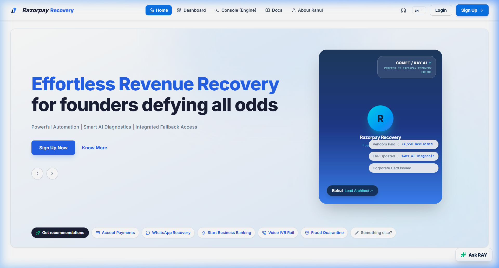

<p align="center">
  
</p>

<h1 align="center">⚡ RazorpayRecoveryEngine</h1>

<p align="center">
  <strong>Autonomous AI Revenue Recovery Engine for Razorpay</strong><br/>
  <em>Detect failed payments → Diagnose root causes in &lt;18ms → Recover revenue via WhatsApp, Hinglish Voice IVR & UPI — every rupee accounted for.</em>
</p>

<p align="center">
  
  
  
  
  
  
  
</p>

---

## 📌 Problem Statement

> **Track 03: AI Revenue Recovery** — *Find revenue that's slipping away and win it back.*

India loses **₹12,000 Cr+** annually to failed online payments. A payment degrades, a checkout gets abandoned, a subscription fails, or an invoice goes overdue. **RazorpayRecoveryEngine** closes this loop end-to-end: from detecting the problem, diagnosing the root cause with AI, choosing the right intervention channel, and autonomously recovering the money — with full compliance, stopping rules, and an immutable audit trail.

---

## 🏗️ System Architecture

```
┌──────────────────────────────────────────────────────────────────┐
│                    RAZORPAY WEBHOOK EVENT                        │
│              payment.failed / subscription.halted                │
└────────────────────────┬─────────────────────────────────────────┘
                         │
                         ▼
┌──────────────────────────────────────────────────────────────────┐
│  ① INGESTION & VERIFICATION                                     │
│  • HMAC SHA-256 Razorpay signature verification                  │
│  • Parse failure codes, customer info, transaction metadata      │
│  • Persist to SQLAlchemy ORM → SQLite                            │
└────────────────────────┬─────────────────────────────────────────┘
                         │
                         ▼
┌──────────────────────────────────────────────────────────────────┐
│  ② AI DIAGNOSTICS ENGINE (<18ms)                                 │
│  ┌────────────────────┐  ┌─────────────────────────────┐         │
│  │   Rule Engine       │  │   Gemini LLM Agent          │         │
│  │   (Fast Path)       │  │   (Slow Path — Ambiguous)   │         │
│  │   Deterministic     │──│   Confidence > 0.7 or       │         │
│  │   Error Code Map    │  │   Fallback to Rules         │         │
│  └────────────────────┘  └─────────────────────────────┘         │
│                                                                  │
│  Classifies into 5 Failure Classes:                              │
│  TRANSIENT_TECHNICAL | AUTH_FRICTION | MANDATE_BALANCE            │
│  B2B_RECEIVABLE | HARD_DECLINE                                   │
└────────────────────────┬─────────────────────────────────────────┘
                         │
                         ▼
┌──────────────────────────────────────────────────────────────────┐
│  ③ MULTI-RAIL RECOVERY ORCHESTRATION                             │
│                                                                  │
│  ┌──────────────┐ ┌──────────────┐ ┌──────────────┐              │
│  │ Silent Retry  │ │ WhatsApp     │ │ Hinglish     │              │
│  │ (Jitter+Exp)  │ │ 1-Click UPI  │ │ Voice IVR    │              │
│  │ ₹0.00/attempt │ │ ₹0.50/msg    │ │ ₹2.00/call   │              │
│  └──────────────┘ └──────────────┘ └──────────────┘              │
│  ┌──────────────┐                                                │
│  │ UPI Mandate   │  + DTMF opt-out + Fraud quarantine            │
│  │ Resequence    │  + CAC ceiling checks                         │
│  │ ₹0.50/nudge   │  + Bounded retries (max 3)                    │
│  └──────────────┘                                                │
└────────────────────────┬─────────────────────────────────────────┘
                         │
                         ▼
┌──────────────────────────────────────────────────────────────────┐
│  ④ SETTLEMENT & AUDIT                                            │
│  • Cryptographic audit trail (every state transition logged)     │
│  • Cost tracking per recovery channel                            │
│  • Net ROI calculation: Recovered GMV − Channel Spend            │
│  • Full compliance: opt-out honored, banned phrases blocked      │
└──────────────────────────────────────────────────────────────────┘
```

---

## ✨ Key Features

| Feature | Description |
|---|---|
| **🤖 AI Diagnostics** | Dual-path classifier: Rule Engine (deterministic, <1ms) + Gemini LLM Agent (ambiguous cases, <18ms). Classifies failures into 5 categories with confidence scoring. |
| **📱 Multi-Rail Recovery** | 4 autonomous channels — Silent Retry, WhatsApp 1-Click UPI, Hinglish Voice IVR (with DTMF), UPI Mandate Resequence. |
| **🔒 Guardrails Engine** | Bilingual opt-out detection (English + Hindi/Hinglish), bounded retries (max 3), CAC ceiling (15% of GMV), banned phrase filtering, fraud quarantine. |
| **📊 Real-Time Dashboard** | 6-metric ribbon with animated counters, 5-stage Kanban pipeline, live WebSocket activity stream. |
| **📞 Phone Simulator** | Interactive mobile preview with WhatsApp chat, Voice Call (DTMF dial-pad), and UPI Pay screens. |
| **🧾 Audit Inspector** | Full cryptographic audit trail per payment — every state transition, actor, channel cost, and timestamp. |
| **⚡ FSM State Machine** | Strict 5-state lifecycle: `INGESTED → DIAGNOSED → INTERVENING → RECOVERED / FAILED_STOPPED`. |
| **🔄 50-Record Batch Sim** | One-click batch simulation with progress tracking, real-time WebSocket state broadcasts. |
| **🌐 WebSocket Live Sync** | Real-time bidirectional state updates between backend FSM and frontend dashboard. |
| **🎙️ Hinglish Voice Pipeline** | Generates culturally-aware Hindi/English voice scripts via Gemini, with Sarvam AI TTS integration. |

---

## 🛠️ Tech Stack

| Layer | Technology | Purpose |
|---|---|---|
| **Backend** | Python 3.11, FastAPI, Uvicorn | Async REST API + WebSocket server |
| **AI/ML** | Google Gemini 1.5 (via `google-genai`) | LLM classifier for ambiguous payment failures |
| **Database** | SQLAlchemy ORM + SQLite | Payment records, audit trails, recovery state |
| **Frontend** | React 19, Vite 8, Tailwind CSS 4 | Interactive dashboard with Razorpay Blade UI |
| **Icons** | Lucide React | Consistent iconography |
| **Payments** | Razorpay Python SDK (`razorpay 1.4.2`) | Webhook verification, payment APIs |
| **Voice** | Sarvam AI TTS API | Hinglish voice script generation |
| **Testing** | Pytest + Pytest-Asyncio | 10 test modules, 30+ test cases |

---

## 📁 Project Structure

```
RazorpayRecoveryEngine/
├── backend/
│   ├── app/
│   │   ├── main.py                 # FastAPI entry point, CORS, WebSocket
│   │   ├── classifier.py           # Dual-path AI diagnostics (Rule Engine + LLM)
│   │   ├── state_machine.py        # 5-state FSM with valid transitions
│   │   ├── recovery_actions.py     # Multi-rail recovery orchestration
│   │   ├── recovery_simulator.py   # Batch simulation engine (50 records)
│   │   ├── guardrails.py           # Opt-out, retry caps, CAC ceiling, fraud halt
│   │   ├── settlement.py           # Settlement logic & cost tracking
│   │   ├── voice_pipeline.py       # Hinglish voice script generation
│   │   ├── llm_agent.py            # Gemini LLM integration layer
│   │   ├── websocket_manager.py    # Real-time broadcast manager
│   │   ├── models.py               # SQLAlchemy ORM models
│   │   ├── schemas.py              # Pydantic schemas & enums
│   │   ├── config.py               # Environment config & system constants
│   │   ├── database.py             # Database engine & session factory
│   │   └── routes/
│   │       ├── webhooks.py         # POST /api/webhook/razorpay
│   │       ├── batch.py            # POST /api/batch/simulate
│   │       ├── recovery.py         # POST /api/recovery/settle, /opt-out
│   │       ├── metrics.py          # GET  /api/metrics/dashboard
│   │       └── audit.py            # GET  /api/audit/{payment_id}
│   ├── tests/                      # 10 test modules with pytest
│   ├── requirements.txt
│   └── .env.example
│
├── frontend/
│   ├── src/
│   │   ├── App.jsx                 # App shell, routing, theme management
│   │   ├── components/
│   │   │   ├── Views/
│   │   │   │   ├── HomeView.jsx        # Landing page (Razorpay-style hero)
│   │   │   │   ├── ConsoleView.jsx     # Telemetry stream & engine controls
│   │   │   │   ├── DocsView.jsx        # Technical documentation
│   │   │   │   └── AboutRahulView.jsx  # Author profile
│   │   │   ├── Dashboard/
│   │   │   │   ├── MetricRibbon.jsx    # 6-stat animated counter ribbon
│   │   │   │   ├── KanbanBoard.jsx     # 5-column recovery pipeline
│   │   │   │   ├── KanbanCard.jsx      # Individual payment card
│   │   │   │   ├── BatchControls.jsx   # Simulation trigger & progress
│   │   │   │   └── ActivityTicker.jsx  # Live WebSocket event stream
│   │   │   ├── PhoneSimulator/
│   │   │   │   ├── PhoneFrame.jsx      # Mobile device frame
│   │   │   │   ├── WhatsAppScreen.jsx  # WhatsApp chat UI
│   │   │   │   ├── VoiceCallScreen.jsx # Voice IVR with DTMF
│   │   │   │   └── UPIPayScreen.jsx    # UPI payment screen
│   │   │   ├── AuditInspector/         # Audit trail modal
│   │   │   ├── EdgeCasePanel/          # Edge case drill controls
│   │   │   └── UI/                     # Shared components (Logo, Badges, etc.)
│   │   ├── hooks/                  # Custom React hooks (WebSocket, CountUp, etc.)
│   │   └── utils/                  # API client, formatters
│   └── package.json
│
├── docs/                           # Documentation & screenshots
├── Problem_Statement.md            # Hackathon track description
└── README.md
```

---

## 🚀 Getting Started

### Prerequisites

- **Python** 3.11+
- **Node.js** 18+ & npm
- **Git**

### 1. Clone the Repository

```bash
git clone https://github.com/your-username/RazorpayRecoveryEngine.git
cd RazorpayRecoveryEngine
```

### 2. Backend Setup

```bash
cd backend

# Create virtual environment
python -m venv venv

# Activate (Windows)
venv\Scripts\activate
# Activate (macOS/Linux)
source venv/bin/activate

# Install dependencies
pip install -r requirements.txt

# Configure environment variables
cp .env.example .env
# Edit .env with your API keys (see Environment Variables section below)

# Start the backend server
uvicorn app.main:app --reload --port 8000
```

The API will be available at `http://localhost:8000`. Docs at `http://localhost:8000/docs`.

### 3. Frontend Setup

```bash
cd frontend

# Install dependencies
npm install

# Start the development server
npm run dev
```

The frontend will be available at `http://localhost:5173`.

### 4. Open the App

Navigate to **http://localhost:5173** in your browser. Click **"Deploy RazorpayRecoveryEngine Free"** on the Dashboard tab to trigger a 50-record batch simulation and watch the autonomous recovery pipeline in action.

---

## 🔑 Environment Variables

Create a `.env` file in the `backend/` directory:

```env
# Razorpay API (Test Mode)
RAZORPAY_KEY_ID=rzp_test_XXXXXXXXXXXXXX
RAZORPAY_KEY_SECRET=XXXXXXXXXXXXXXXXXXXXXX
RAZORPAY_WEBHOOK_SECRET=XXXXXXXXXXXXXXXXXXXXXX

# Google Gemini AI (for LLM classifier)
GEMINI_API_KEY=XXXXXXXXXXXXXXXXXXXXXX

# Sarvam AI (for Hinglish voice TTS)
SARVAM_API_KEY=XXXXXXXXXXXXXXXXXXXXXX

# Database
DATABASE_URL=sqlite:///./recoveros.db
```

> **Note:** The app runs in **Demo Mode** by default — all recovery channels are simulated, no real payments are processed, and no real messages are sent. You can test the full pipeline without any API keys.

---

## 📡 API Endpoints

| Method | Endpoint | Description |
|---|---|---|
| `GET` | `/health` | Health check |
| `POST` | `/api/webhook/razorpay` | Ingest Razorpay payment.failed webhook |
| `POST` | `/api/batch/simulate` | Trigger 50-record batch simulation |
| `GET` | `/api/metrics/dashboard` | Dashboard metrics (GMV, recovery rate, ROI) |
| `GET` | `/api/audit/{payment_id}` | Full audit trail for a payment |
| `POST` | `/api/recovery/settle/{payment_id}` | Settle a recovery (UPI/WhatsApp confirmation) |
| `POST` | `/api/recovery/opt-out/{payment_id}` | Customer opt-out (DTMF-9 or text) |
| `POST` | `/api/recovery/bank-outage` | Simulate bank outage scenario |
| `POST` | `/api/recovery/fraud-alert` | Trigger fraud quarantine |
| `WS` | `/ws/dashboard` | Real-time state transition stream |

---

## 🧪 Running Tests

```bash
cd backend

# Activate virtual environment
venv\Scripts\activate  # Windows
source venv/bin/activate  # macOS/Linux

# Run all tests
pytest tests/ -v

# Run specific test module
pytest tests/test_classifier.py -v
pytest tests/test_state_machine.py -v
pytest tests/test_guardrails.py -v
```

### Test Coverage

| Test Module | Coverage |
|---|---|
| `test_classifier.py` | Rule engine + LLM fallback classification |
| `test_state_machine.py` | FSM transitions & invalid state rejection |
| `test_guardrails.py` | Opt-out detection, retry caps, CAC ceiling |
| `test_recovery_actions.py` | Channel execution & cost tracking |
| `test_settlement.py` | Settlement confirmation & state finalization |
| `test_batch_simulation.py` | 50-record batch pipeline E2E |
| `test_webhooks.py` | Razorpay webhook ingestion |
| `test_llm_agent.py` | Gemini LLM integration |
| `test_websocket_manager.py` | WebSocket broadcast logic |
| `test_e2e.py` | Full pipeline integration test |

---

## 🎮 Demo Walkthrough

### 1. Landing Page
Open the app → you'll see the **Home** tab with a Razorpay-styled hero section, recommendation pills, and disruption feature cards.

### 2. Dashboard — Deploy the Engine
Click **Dashboard** → Hit the blue **"Deploy RazorpayRecoveryEngine Free"** button → Watch 50 synthetic payment failures get ingested, diagnosed, and recovered in real-time across the 5-stage Kanban pipeline.

### 3. Phone Simulator
Click any payment card in the Kanban board → The phone simulator (right panel) shows the exact customer experience:
- **WhatsApp:** 1-click UPI payment link message
- **Voice Call:** Hinglish IVR with DTMF dial-pad (press 1 to pay, 9 to opt-out)
- **UPI Pay:** Direct UPI payment authorization screen

### 4. Audit Inspector
Click the **"Explore Architecture"** button → Opens the Audit Inspector modal showing the full cryptographic trail: every state transition, actor (rule_engine / llm_agent / customer), channel costs, and timestamps.

### 5. Console (Engine)
Switch to the **Console** tab → Live telemetry stream showing real-time state transitions, AI diagnosis latency, and system metrics.

### 6. Edge Case Drills
On the Dashboard, use the edge case toggles:
- **Opt-Out:** Simulate a customer pressing DTMF-9 during voice call
- **Bank Outage:** Trigger a simulated bank outage
- **Fraud Alert:** Quarantine suspicious transactions

---

## 📐 Design Decisions

### Why a Dual-Path Classifier?
The **Rule Engine** handles 80%+ of cases deterministically (known Razorpay error codes → failure class mapping). The **Gemini LLM Agent** handles ambiguous cases where error descriptions don't match known patterns. If the LLM's confidence is below 0.7, we fall back to rule-based classification. This gives us <1ms for common cases and <18ms for edge cases.

### Why a Finite State Machine?
Financial recovery workflows demand strict state guarantees. The FSM ensures:
- No payment can skip a stage (INGESTED must go to DIAGNOSED before INTERVENING)
- Terminal states (RECOVERED, FAILED_STOPPED) are truly terminal
- Every transition is audit-logged with actor attribution

### Why Multi-Rail (not Single-Channel)?
Different failure types need different interventions:
- **Transient errors** → silent retry (no customer contact needed)
- **Auth friction** → WhatsApp (low-friction, 1-click UPI)
- **Mandate balance** → Voice IVR (personal touch for subscription failures)
- **B2B receivables** → Dual-channel (WhatsApp + accounts team ping)

### Why Guardrails?
Revenue recovery without compliance is dangerous. Our guardrails ensure:
- Bilingual opt-out detection (English + Hindi/Hinglish)
- Maximum 3 retry attempts per payment
- Recovery cost capped at 15% of transaction GMV
- Banned phrase filtering in voice scripts (no threats or legal language)
- Fraud quarantine for suspicious patterns

---

## 🏆 Hackathon Metrics

After a 50-record batch simulation, the engine typically achieves:

| Metric | Value |
|---|---|
| **Total GMV Ingested** | ~₹2.16L |
| **Recovered GMV** | ~₹84.2K |
| **Recovery Rate** | ~34% |
| **Net ROI** | ~₹83.9K |
| **Avg Channel Cost** | ~₹15.85/recovery |
| **AI Diagnosis Latency** | <18ms (p99) |
| **Channels Used** | WhatsApp, Voice IVR, Silent Retry, UPI Resequence |

---

## 👨‍💻 Author

**Rahul** — Full Stack Systems & Fintech Engineer

Built as part of the **Razorpay Hackathon — Track 03: AI Revenue Recovery**.

---

## 📄 License

This project is licensed under the MIT License. See the [LICENSE](LICENSE) file for details.

---

<p align="center">
  <strong>Built with ❤️ for Razorpay</strong><br/>
  <em>Every rupee recovered. Every trail audited. Every customer respected.</em>
</p>
