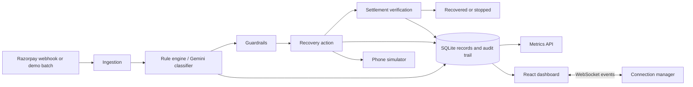
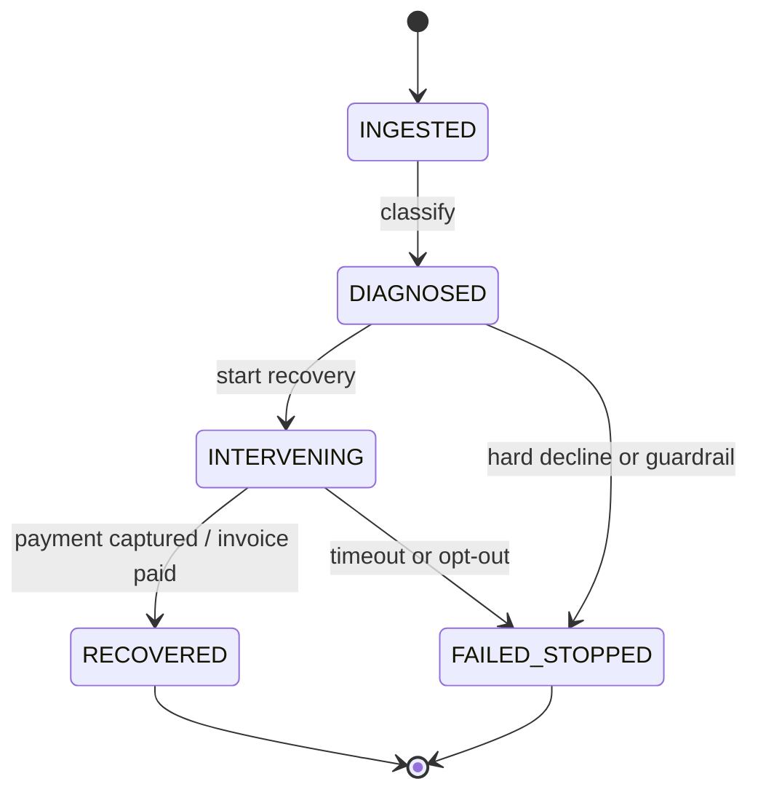

# RecoverOS Architecture

## Runtime Flow

## State Machine

`backend/app/state_machine.py` owns transition validation, audit creation, and state-change broadcasts. Terminal states cannot be re-entered or changed.

## Backend Modules

- `classifier.py` maps known error codes deterministically and routes unknown reasons through `llm_agent.py`.
- `guardrails.py` enforces opt-out detection, retry caps, CAC ceilings, and hard-decline halts.
- `recovery_actions.py` dispatches silent retry, WhatsApp, mandate resequencing, voice, or no-action handling.
- `settlement.py` correlates captured payments and paid invoices to tracked records.
- `recovery_simulator.py` processes the 50-record demo dataset with configurable recovery probabilities.
- `routes/` exposes batch, recovery, webhook, metrics, audit, and voice endpoints.

## Frontend Flow

`App.jsx` loads dashboard metrics and resolves the selected phone record from the current record list. `useWebSocket` receives state, metric, and batch-progress events; `useBatchSimulation` starts a run and polls its status. The Kanban board opens the audit inspector, while the phone simulator demonstrates WhatsApp, voice, and UPI flows.

## Guardrails and Audit

Every state transition and recovery action writes an `AuditTrailEntry`. Hard declines produce a `WHY_WE_DIDNT_ACT` explanation. Customer opt-out and DTMF stop actions transition active records to `FAILED_STOPPED`. Channel costs are tracked in INR and compared against 15% of the record amount.

## API Surface

- `GET /health`
- `POST /api/batch/run`
- `GET /api/batch/{batch_id}/status`
- `POST /api/webhooks/razorpay`
- `GET /api/recovery/{payment_id}`
- `POST /api/recovery/{payment_id}/opt-out`
- `POST /api/recovery/{payment_id}/settle`
- `POST /api/recovery/{payment_id}/dtmf?key=1`
- `GET /api/voice/{payment_id}`
- `GET /api/metrics/dashboard`
- `GET /api/audit/{payment_id}`
- `ws://localhost:8000/ws/dashboard`
