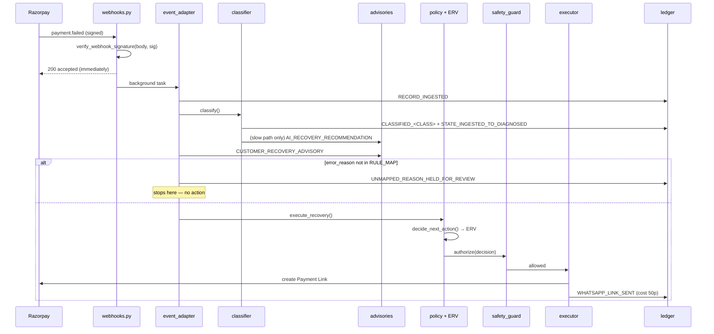
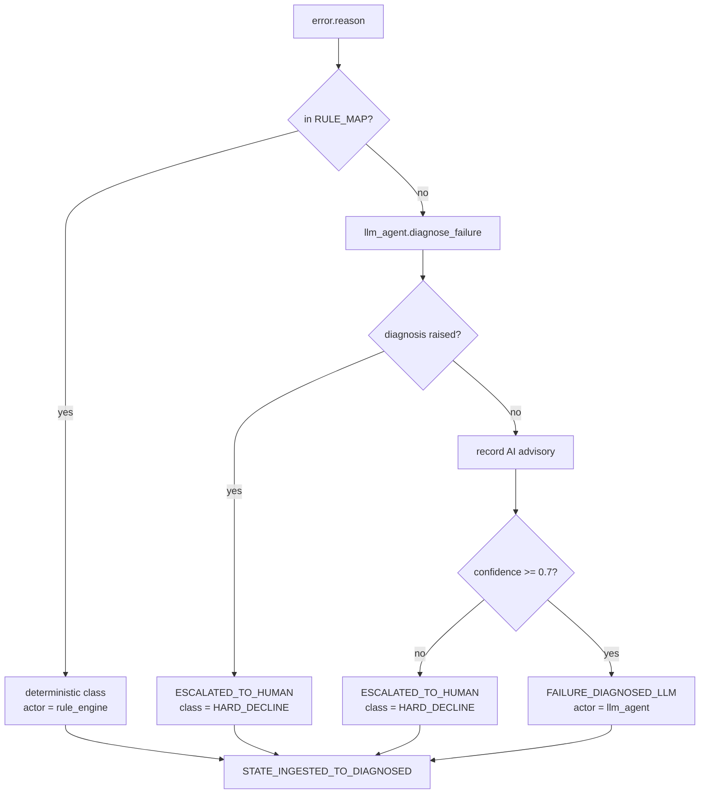
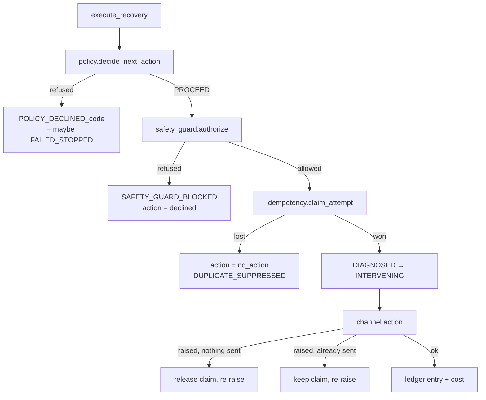
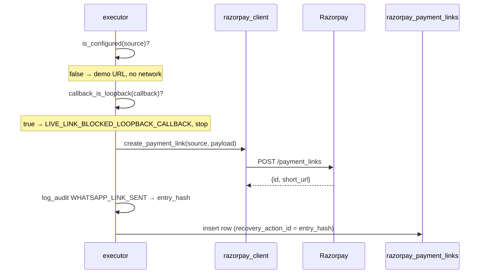

# RecoverOS — Technical Architecture

> **Scope of this document.** Everything below describes code that exists in this
> repository. Where a capability is absent, partial, or known to be weak, it is
> said so plainly — see [Known limitations](#21-known-limitations). Where a number
> appears, the command or file that produces it is named.
>
> Original work of **Rahul Hongekar** · Razorpay Buildathon, Track 03.

---

## Contents

1. [System architecture](#1-system-architecture)
2. [Module responsibilities](#2-module-responsibilities)
3. [Data flow](#3-data-flow)
4. [Webhook lifecycle](#4-webhook-lifecycle)
5. [Classification flow](#5-classification-flow)
6. [AI advisory flow](#6-ai-advisory-flow)
7. [Customer personalization](#7-customer-personalization)
8. [Policy ladder](#8-policy-ladder)
9. [Expected Recovery Value](#9-expected-recovery-value)
10. [Safety Guard](#10-safety-guard)
11. [Recovery execution](#11-recovery-execution)
12. [Payment Link lifecycle](#12-razorpay-payment-link-lifecycle)
13. [Settlement correlation](#13-settlement-correlation)
14. [Idempotency and concurrency](#14-idempotency-and-concurrency)
15. [Recovery tick](#15-recovery-tick)
16. [Ledger and audit trail](#16-ledger-and-audit-trail)
17. [Metrics and cohort economics](#17-metrics-and-cohort-economics)
18. [Failure modes and fail-closed behaviour](#18-failure-modes-and-fail-closed-behaviour)
19. [Security considerations](#19-security-considerations)
20. [Testing strategy](#20-testing-strategy)
21. [Known limitations](#21-known-limitations)

---

## 1. System architecture

RecoverOS is a FastAPI application over SQLite (SQLAlchemy ORM), with a React
dashboard. There is no queue, no worker pool and no external state store: the
database *is* the coordination mechanism, and every guarantee in this document
is enforced by a constraint or a conditional write rather than by application
convention.

The layering that matters is the authority gradient. Each arrow narrows what
the next stage may do:

```mermaid
flowchart LR
    A[Razorpay<br/>webhook] --> B[Diagnose<br/><i>rules, then model</i>]
    B --> C[Advisory<br/><i>AI + customer context</i>]
    C --> D[Policy<br/><i>deterministic ladder</i>]
    D --> E[ERV<br/><i>economic gate</i>]
    E --> F[Safety Guard<br/><i>authorization</i>]
    F --> G[Executor<br/><i>performs the action</i>]
    G --> H[Settlement<br/><i>signed webhook</i>]
    H --> I[Ledger + Metrics]

    style C fill:#EFF6FF,stroke:#2B6DEF
    style D fill:#ECFDF3,stroke:#12B76A
    style E fill:#ECFDF3,stroke:#12B76A
    style F fill:#FEF0C7,stroke:#F79009
```



- **Diagnosis** produces a failure class and nothing else.
- **Advisory** produces a recommendation and nothing else. It can be ignored.
- **Policy** turns a class into a channel, an attempt number and a cost, from
  tables written in code.
- **ERV** asks whether that specific attempt is worth its cost.
- **The Safety Guard** re-derives channel and cost from those same tables and
  refuses anything that does not match.
- **The Executor** performs exactly what it was authorised to perform.

A model can influence *what kind of failure this is believed to be*, and
nothing further. There is no parameter anywhere downstream through which a
model-produced channel, amount, state or API call could arrive.

### Storage

| Table | Purpose |
|---|---|
| `payment_failure_records` | one row per payment being recovered |
| `audit_trail_entries` | the append-only hash chain |
| `razorpay_payment_links` | correlation between our record and a link at Razorpay |
| `recovery_attempt_claims` | exactly-once reservation of one attempt |
| `consent_records` | opt-out registry, keyed by SHA-256 of the normalized phone |
| `batch_runs` | one row per simulated batch |

Money is integer **paise** everywhere; audit timestamps are integer
**microseconds**; model confidence is integer **basis points**. No float ever
enters a hash preimage, because float arithmetic is not reproducible across
runtimes and the chain must verify identically on any machine.

---

## 2. Module responsibilities

| Module | Responsibility |
|---|---|
| `routes/webhooks.py` | HMAC verification, event dispatch, the payer landing page |
| `event_adapter.py` | webhook body → record; idempotent ingest; unmapped-reason hold |
| `classifier.py` | `RULE_MAP` fast path; LLM slow path; FSM entry |
| `llm_agent.py` | every Gemini prompt, and the guards on model output |
| `llm_cache.py` | record/replay of model responses; raises rather than inventing |
| `ai_advisor.py` | structured AI recommendation, recorded, never authorising |
| `customer_profile.py` | per-contact history → personalized advisory |
| `policy.py` | the deterministic decision: channel, attempt, cost, stop reason |
| `erv.py` | expected value of one candidate action |
| `safety_guard.py` | final authorization; 13 checks; first refusal wins |
| `recovery_actions.py` | the four channel implementations + `execute_recovery` |
| `idempotency.py` | atomic claims: state, link, attempt |
| `recovery_tick.py` | advances open live recoveries; makes the ladder reachable |
| `settlement.py` | payment → record correlation; exactly-once RECOVERED |
| `ledger.py` | hash chain: append, verify, head |
| `state_machine.py` | FSM transitions, all written through the ledger |
| `guardrails.py` | attempt counting, spend, CAC ceiling, opt-out patterns |
| `consent.py` | phone normalization, consent registry, TRAI quiet hours |
| `intervention_economics.py` | per-channel attribution: attempts, wins, spend, ROI |
| `routes/metrics.py` | cohort-scoped dashboard aggregation |
| `recovery_simulator.py` | the synthetic batch; never touches the live path |
| `outcome_engine.py` | deterministic simulated outcomes for the batch |

**Modules that cannot act.** `ai_advisor.py`, `customer_profile.py` and `erv.py`
import nothing capable of performing an action — no `recovery_actions`, no
`razorpay_client`, no `voice_pipeline`, no `settlement`, no HTTP client. This is
enforced by tests that parse each module's own AST, not by convention.

---

## 3. Data flow



The webhook is acknowledged **before** the work happens. Razorpay retries on a
slow response, and classification can involve a model call; holding the
connection open invites duplicate deliveries.

---

## 4. Webhook lifecycle

`POST /api/webhooks/razorpay`

1. **Signature.** `verify_webhook_signature` computes HMAC-SHA256 over the exact
   bytes received and compares with `hmac.compare_digest`. It **fails closed**
   outside demo mode: a missing or placeholder `RAZORPAY_WEBHOOK_SECRET` rejects
   the request rather than accepting it. A forged `payment.failed` is an
   instruction to create a Payment Link and message a stranger.
2. **Parse.** A body that is not JSON, or not an object, is a `400` — not a
   `500`, because this body will never become valid and a redelivery is
   pointless.
3. **Dispatch** by `event`:

| Event | Handler | Effect |
|---|---|---|
| `payment.failed` | `event_adapter.ingest_and_process` (background) | ingest, classify, maybe act |
| `payment_link.paid` | `settlement.handle_payment_link_paid` | settle via the link row |
| `payment.captured` | `settlement.handle_payment_captured` | direct match, then link fallback |
| `invoice.paid` | `settlement.handle_invoice_paid` | B2B receivable |
| anything else | — | `{"status": "ignored"}` |

`GET /api/webhooks/razorpay` is the payer's browser landing page after a link is
paid. **It changes no state.** Its parameters live in a URL the payer can edit,
so treating them as proof of payment would let anyone mark a record recovered by
typing a different id into the address bar. Settlement happens on the signed
webhook, one second earlier, over a channel the payer cannot forge.

---

## 5. Classification flow



`RULE_MAP` holds nine error codes a human has explicitly approved. It is the
fast path and the majority path. Everything else goes to the model.

Three properties worth stating:

- **The model can add a stop, never remove one.** Low confidence, unparseable
  output, or an invented sixth class all degrade to `HARD_DECLINE`, which has an
  empty escalation ladder and therefore no possible action.
- **A raised diagnosis is not a weak diagnosis.** If the model call itself
  fails, nothing is invented to fill the gap; the record is escalated to a human
  and no advisory is recorded.
- **The AI advisory is written before the confidence branch**, so a weak reading
  is preserved as evidence rather than discarded.

---

## 6. AI advisory flow

`app/ai_advisor.py`. Runs only on the classifier's slow path — i.e. only for
error codes `RULE_MAP` does not cover.

**What is recorded:** one zero-cost ledger entry, `AI_RECOVERY_RECOMMENDATION`,
actor `llm_agent`, containing interpretation, recommended channel, confidence,
rationale, evidence, and a `review_required` flag.

**Storage:** no new table and no new column. Confidence rides in
`llm_confidence_bp`, where every other model confidence already lives. The
structured body rides in `details` behind the marker
`AI_RECOMMENDATION_JSON=`, so the audit line is still a sentence a person can
read while remaining machine-readable underneath. JSON is serialized with sorted
keys and no whitespace, so the same recommendation produces the same bytes and
therefore the same entry hash on any machine.

**Four independent reasons it cannot execute anything:**

1. **The model never names a channel.** It names one of five failure classes.
   The channel is looked up in `RECOMMENDED_CHANNEL_BY_CLASS`, derived from
   `policy.ATTEMPT_LADDER`. `HARD_DECLINE`'s ladder is empty, so a compliance
   halt recommends nothing.
2. **The module cannot import an executor** (AST-enforced, see §2).
3. **`safety_guard.authorize` refuses by type.** Its first check is
   `isinstance(decision, PolicyDecision)`; a `Recommendation` — or the model's
   raw JSON as a dict — is rejected before one field is read.
4. **`execute_recovery` never reads a recommendation.** It calls
   `policy.decide_next_action`, which reads the record's class and the ladder.

That last one is tested directly: a record whose advisory recommends
`hinglish_voice` at 99% confidence still gets `whatsapp_link`, because that is
what the ladder says.

---

## 7. Customer personalization

`app/customer_profile.py`. Answers *why this customer, why this channel, why
now* — keyed on the normalized phone number the consent registry already treats
as a customer's identity, so `+91 98123-45678` and `9812345678` are one history
rather than two.

| Signal | Source |
|---|---|
| previous outcomes | prior records' `recovery_state` |
| successful methods | `method` on records that reached RECOVERED |
| effective channel | `intervention_economics.by_intervention` over that contact's own records |
| failure patterns | `error_reason` / `failure_class` counts |
| payment timing | IST hour of each `STATE_*_TO_RECOVERED` entry |

Reusing `by_intervention` means "voice works for this customer" and "voice works
overall" are the same sentence measured the same way. It is also the feedback
loop: the profile is a read, so an intervention that lands today is evidence
tomorrow with nothing written back.

**Nothing is invented.** Thresholds are named constants, not buried
conditionals:

| Constant | Value | Meaning |
|---|---|---|
| `MIN_RESOLVED_FOR_ADVICE` | 1 | below this, no channel claim at all |
| `MIN_RESOLVED_FOR_PREFERENCE` | 2 | below this it is `thin`, a data point not a pattern |
| `MIN_RECOVERIES_FOR_TIMING` | 2 | one settlement is an anecdote, not an hour |

Confidence is a stated formula: `min(0.45 + 0.15 × resolved, 0.90)`, and exactly
`0.0` when sufficiency is `none`. Three ignored WhatsApp links with no recovery
names **no** effective channel — that is a habit of ours, not a preference of
theirs. A new contact gets one line: *"No prior payments from this contact in
this system."*

**Why now** is derived from constraints that already exist elsewhere, restated
where a reader can see them: a stated promise to pay, TRAI quiet hours for voice
channels, and the 30-minute follow-up window. The customer's own historical hour
is reported as an observation and never used to hold a payment back.

The recommendation may name a channel the ladder will not use. When it does,
`overridden_by_policy` is true and the executor follows the ladder — an advisory
nobody can override is not an advisory.

**Attribution note.** This reading is arithmetic over the customer's records,
not a model call, so it is recorded under actor `profile_engine` rather than
`llm_agent`. A ledger whose purpose is to say who did what must not credit a
model for counting.

---

## 8. Policy ladder

`app/policy.py`. The deterministic decision. Checks run cheapest-and-most-
fundamental first, and **the first refusal wins**, so the recorded reason is the
deepest one rather than whichever was evaluated last.

```
1. HARD_DECLINE            compliance halt — never contact, at any cost
2. HOLDOUT_CONTROL         the control arm is observed, never treated
2b. PROMISE_TO_PAY_PENDING a stated date defers; it does not stop
3. LADDER_EXHAUSTED        no ladder defined for this class
4. RETRY_CAP_REACHED       MAX_RETRIES = 3 attempts in this batch
5. LADDER_EXHAUSTED        this class's ladder is shorter than the cap
6. CAC_CEILING             spend would exceed 15% of the payment
7. NEGATIVE_EXPECTED_VALUE cost beats the class-average margin
8. CONSENT_WITHDRAWN       opt-out registry
   QUIET_HOURS_DEFERRED    TRAI 21:00–09:00 IST, voice only
9. ECONOMICALLY_UNVIABLE   ERV — this attempt is not worth its cost
   PROCEED
```

The escalation ladder, per failure class:

| Class | Rungs | Cost per rung |
|---|---|---|
| `TRANSIENT_TECHNICAL` | `silent_retry` × 5 | 0p |
| `AUTH_FRICTION` | `whatsapp_link` × 2 | 50p |
| `MANDATE_BALANCE` | `upi_resequence` → `whatsapp_link` | 50p |
| `B2B_RECEIVABLE` | `whatsapp_link` → `hinglish_voice` → `human_queue` | 50p → 200p → 0p |
| `HARD_DECLINE` | *(empty)* | — |

The ladder is what makes `MAX_RETRIES` reachable: a single-shot design can never
reach a cap of three. `TRANSIENT_TECHNICAL`'s ladder is deliberately longer than
the cap so the cap is what fires.

Three refusals leave the record **open** rather than closing it —
`QUIET_HOURS_DEFERRED`, `HOLDOUT_CONTROL`, `PROMISE_TO_PAY_PENDING`. Everything
else transitions to `FAILED_STOPPED`.

---

## 9. Expected Recovery Value

`app/erv.py`. Policy check 8, evaluated **last**.

```
expected_value = amount × probability        (integer paise × basis points)
expected_net   = expected_value − action cost
expected_net <= 0  →  ECONOMICALLY_UNVIABLE
```

Break-even is a refusal, not an approval: an attempt that only matches its own
cost in expectation has spent real money and real customer patience for nothing.

**Probability, most specific first, always labelled:**

| Source | Threshold | Example basis string |
|---|---|---|
| `customer_history` | ≥ 3 attempts on this channel for this contact | *"0 of 4 previous whatsapp_link attempts on this contact were recovered."* |
| `channel_history` | ≥ 20 attempts on this channel across all records | *"10 of 38 whatsapp_link attempts across all records were recovered."* |
| `default_estimate` | otherwise | *"Default estimate for AUTH_FRICTION (40%) — not observed."* |

Both history sources are `intervention_economics.by_intervention`, reused
unchanged. There is **no model here and nothing to train**. Every estimate
carries an `observed` flag, and the trace appends *"(default estimate)"* when
the number is an assumption, because `62%` reads as a measurement and should not
when it is not one.

Worked example, in the units the system actually uses — a WhatsApp send costs
**50 paise**, not ₹50:

```
Payment: Rs 5,000.00
Action: WhatsApp Link
Estimated success: 62%
Expected recovery: Rs 3,100.00
Cost: Rs 0.50
Expected net: Rs 3,099.50
Decision: PROCEED
```

And the case ERV exists for — four links to this contact, none paid:

```
Estimated success: 0%
Expected recovery: Rs 0.00
Cost: Rs 0.50
Expected net: -Rs 0.50
Decision: STOP - ECONOMICALLY UNVIABLE
Basis: 0 of 4 previous whatsapp_link attempts on this contact were recovered.
```

The flat per-class rate says `AUTH_FRICTION` recovers 40% of the time, so it
would have approved a fifth message forever. That is the gap ERV closes.

**Why it runs last.** Every check above is more fundamental. The reason code is
what an operator acts on, so an economic stop must never mask a compliance one.
Moving ERV ahead of the consent check is a mutation the test suite catches.

**Channel statistics are memoized** on the SQLAlchemy session and keyed on the
ledger head. The chain is append-only, so while the head is unchanged nothing
already counted can have changed — which makes the head a sound cache key and
stops a 65-record batch walking the whole ledger 65 times. The key is also what
makes the cache notice an outcome that lands mid-session.

---

## 10. Safety Guard

`app/safety_guard.py`. The final authorization point. Pure `authorize()` reads
and returns a verdict; ledger-writing `block()` records a refusal.

Thirteen checks, first refusal wins:

| # | Code | Refuses when |
|---|---|---|
| 1 | `NOT_A_POLICY_DECISION` | the object is not a `PolicyDecision`, or does not carry `PROCEED` |
| 2 | `SOURCE_NOT_PERMITTED` | execution source is unknown, or does not match the record's own |
| 3 | `UNKNOWN_CHANNEL` | the channel is not a rung of any ladder |
| 4 | `UNCLASSIFIED` | the record carries no recognised failure class |
| 5 | `CLASS_CHANNEL_MISMATCH` | this channel is not a step in *this class's* ladder |
| 6 | `TERMINAL_STATE` / `INVALID_STATE` | the record is settled, or not yet diagnosed |
| 7 | `UNMAPPED_REASON` | a **live** record whose error code is not in `RULE_MAP` |
| 8 | `HELD_FOR_REVIEW` | a human has already been asked to look at it |
| 9 | `LOW_CONFIDENCE` | the recorded diagnosis confidence is below threshold |
| 10 | `ATTEMPT_LIMIT` | attempts already at or above the cap |
| 11 | `STALE_DECISION` | the decision's attempt number disagrees with the ledger |
| 12 | `COST_MISMATCH` | the cost does not match `CHANNEL_ACTION_COST_PAISE` |
| 13 | `SPEND_LIMIT` | the spend would breach the CAC ceiling |

The guard **re-derives** channel and cost from the same deterministic tables
policy used, rather than trusting the numbers it is handed. It deliberately does
not import `recovery_actions` — the guard must not depend on the thing it
guards.

Check 7 is scoped to `LIVE_SOURCE` on purpose. The seeded dataset contains eight
error codes the rule engine does not know; they exist to exercise the model's
slow path, and holding them would change what the simulator measures rather than
protect anyone.

**A refusal is an outcome, not a silence.** It writes `SAFETY_GUARD_BLOCKED`
(actor `safety_guard`, cost 0), makes no state transition, calls nothing, and
leaves the record where it was so a person can pick it up. It returns
`action="declined"` — a verb the simulator's loop already terminates on, which
is why the demo needed no change.

---

## 11. Recovery execution

`recovery_actions.execute_recovery(db, record, now, is_holdout, source)` performs
**one** policy-approved step. The caller loops. That keeps the decision, the
action and the outcome separable, and means every attempt gets a fresh guard
evaluation instead of one check at the start.



`source` defaults to the record's own, so a caller that forgets it cannot
accidentally upgrade a synthetic record to the live path — the record itself
carries where it came from.

The four channel actions each gate their own customer contact on the consent
registry, inside the action rather than once at the policy boundary, so a
channel added later cannot accidentally skip the check.

---

## 12. Razorpay Payment Link lifecycle



Three things this ordering buys:

- **Fail closed before the API call.** A live link whose callback is a loopback
  host strands the payer on their own device. Once Razorpay has created it, the
  damage is a real URL that can be sent to a real person — so the refusal
  happens *before* creation, and the action stops rather than falling back to a
  demo URL a live customer would be given as if it were genuine.
- **No correlation row for a link that does not exist.** A demo placeholder URL
  gets no row: a row here asserts that a real link with this id exists at
  Razorpay, and settlement will trust it.
- **The ledger entry is written first**, so its `entry_hash` becomes the
  `recovery_action_id`. The correlation is only valid while that entry's content
  is unaltered.

Links expire 30 minutes after creation (`PAYMENT_LINK_EXPIRY_MINUTES`). Razorpay
requires at least 15; 30 leaves a margin that network latency cannot erase.

**The live path is gated on `source` as well as `DEMO_MODE`**, so the synthetic
batch cannot reach the network even with real credentials loaded.

---

## 13. Settlement correlation

Two events can settle the same rupee, and Razorpay emits both.

| Event | Correlation |
|---|---|
| `payment_link.paid` | names the link; we hold a row proving which record that link was created for. **The reliable path.** |
| `payment.captured` | direct match on payment id first; falls back to link correlation *only when the payload genuinely contains a link id* |

`_extract_payment_link_id` returns `None` rather than reconstructing an id.
Guessing which link a captured payment belongs to — by amount, by recency, by
anything — would let one customer's payment recover a different customer's
record, which is the worst failure this system could have.

Before transitioning, `_settle_via_payment_link` checks amount and currency
against the link row, and treats webhook `notes` as defence in depth only: a
match adds confidence, a mismatch is disqualifying, and absence proves nothing.
Every refusal writes `SETTLEMENT_MISMATCH_HELD` and changes nothing else.

---

## 14. Idempotency and concurrency

`app/idempotency.py`. Razorpay retries delivery on any non-2xx and on a timeout,
fires two event types for one rupee, and the recovery tick is an endpoint anyone
can call twice. Every protection used to be read-then-write — correct in a
single thread, atomic nowhere.

| Primitive | Mechanism | Closes |
|---|---|---|
| `claim_state` | one conditional `UPDATE … WHERE recovery_state IN (…)`; `rowcount == 1` wins | two RECOVERED transitions for one payment |
| `claim_link` | the same, on the link's settled flag | two deliveries both settling one link |
| `claim_attempt` | `INSERT` against `UNIQUE(payment_id, batch_key, attempt_number)` | two workers both messaging one customer |

`transition_state` now returns whether **this** caller made the transition, and
the settlement callers check it — answering "recovered" for a transition another
delivery made is how a duplicate webhook becomes a duplicate figure downstream.

**Why the attempt claim needed a table.** The other two are compare-and-set on a
value the operation itself changes. An attempt is not: the third WhatsApp
message leaves the record in the same state as the second, so no existing column
distinguishes *about to make attempt 2* from *about to make attempt 2 again*. A
counter column would have to be written before the action and rolled back after
a failure — the same read-then-write problem one level down. A UNIQUE insert is
atomic across processes and survives a restart, and it is the technique this
codebase already trusts: the ledger cannot fork because two rows may not share a
`prev_hash`.

**`batch_key` is a `""` sentinel, not a nullable batch id.** SQL treats NULLs as
distinct, so a nullable column would accept `(pay_x, NULL, 0)` twice — and every
live webhook record carries no batch. Without the sentinel the claim would have
protected the demo and left the real path wide open.

**Retry after partial failure** is decided by whether the customer was actually
contacted. If the action raised and the attempt count did not increase, the
claim is released so the next tick retries that rung; if a send was already on
the ledger, the claim is kept, because releasing it would send a second copy of
the same message.

Duplicate ingestion of `payment.failed` is caught by the primary key and
reported as `{"status": "duplicate"}` on a clean session, rather than surfacing
as an unhandled `IntegrityError` in the webhook log.

---

## 15. Recovery tick

`POST /api/recovery/tick` and `python -m app.tools.run_tick`.

The live path calls `execute_recovery` once per webhook and never again, so
without something driving this the escalation ladder stops at rung one, the
attempt cap is unreachable, and a quiet-hours deferral is a permanent halt
rather than a pause.

`advance_open_recoveries` selects every live record in `DIAGNOSED` or
`INTERVENING` and skips:

| Skip reason | Why |
|---|---|
| `HELD_FOR_REVIEW` | a person has been asked to look; automation must not overtake that |
| `LINK_STILL_PAYABLE` | an unsettled, unexpired link exists — closing would lose a late payment |
| `ATTEMPT_TOO_RECENT` | inside the 30-minute follow-up window |

`dry_run` defaults to **true** on the endpoint and in the CLI: a misconfigured
caller that forgets the flag should report what it would do rather than message
customers. A dry run makes zero writes and zero external calls, and returns the
identical selection a real tick would act on, so the preview and the action
cannot disagree.

One record raising does not abort the pass — the session is rolled back, the
failure is recorded in `failed[]`, and the tick continues.

---

## 16. Ledger and audit trail

`app/ledger.py`. `audit_trail_entries` is a hash chain, not an ordinary table.

- `sequence_no`, `prev_hash` and `entry_hash` are all **UNIQUE**. The constraint
  on `prev_hash` is what makes a fork structurally impossible: forking would
  require two rows claiming the same predecessor.
- The preimage is length-prefixed and uses integer paise and integer
  microseconds, so it is byte-reproducible across machines and runtimes.
- Append is optimistic, not locked: a racing writer loses on `IntegrityError`,
  re-reads the head and retries. The guarantee is enforced by the schema, not by
  the caller holding a lock correctly — which is what makes it hold across
  threads, event loops and separate uvicorn workers alike.
- Mutation and deletion are blocked twice: SQLAlchemy `before_update` /
  `before_delete` listeners **and** SQLite triggers.

`python -m app.tools.tamper_demo` edits a cost directly in the SQLite file,
outside the application, after dropping the triggers — and `verify_ledger` names
the row, the payment, the action, and both hashes.

**Every refusal is on the chain.** Restraint is an output of this system, not an
absence of one, and it is as auditable as a recovery:
`POLICY_DECLINED_<CODE>`, `SAFETY_GUARD_BLOCKED`, `SUPPRESSED_CONSENT`,
`UNMAPPED_REASON_HELD_FOR_REVIEW`, `SETTLEMENT_MISMATCH_HELD`,
`LIVE_LINK_BLOCKED_LOOPBACK_CALLBACK`, `WHY_WE_DIDNT_ACT`.

---

## 17. Metrics and cohort economics

`GET /api/metrics/dashboard?scope=batch|live|all&batch_id=…`

**Cohort scoping exists because the endpoint used to answer a different
question.** It summed every record ever stored while scoping cost to non-null
batch ids — so a live recovery's GMV counted as revenue and its spend did not
count as cost, and the lift block, keyed on `arm`, described a third population
again. Three denominators, printed as one number, erring in the flattering
direction.

Now revenue, recovery rate, cost, ROI, class breakdown and lift are all computed
over **one** population, and the reading says which:

```json
"cohort": {"scope": "batch", "batch_id": "...", "record_count": 65,
           "sources": ["synthetic"], "arm_coverage": {"with_arm": 60, "without_arm": 5}}
```

`arm_coverage` exists because lift is computed from `arm`, which only the
simulator assigns. Live records carry none, so a lift reported beside a recovery
rate over a wider population was describing a subset without saying so.

**Per-intervention economics** (`intervention_economics.py`) answers *which
recovery actions recovered how much money, at what cost, with what ROI*. The
attribution rule is deliberately narrow:

> A recovery is credited to the **last attempt made before** the record
> transitioned to RECOVERED — and to **nothing at all** when no attempt preceded
> it.

Both halves matter. Crediting the last attempt lets an escalation ladder report
honestly: when a WhatsApp link is ignored and the voice call that follows gets
paid, the voice call closed it. Crediting nothing keeps the holdout arm honest —
the control group is never contacted and some of it pays anyway; those rupees
are real, counted, and belong to no channel.

Scoping is by each record's own `batch_id`, because the ledger is append-only: a
re-run adds entries against the same payment ids, and keying on payment id alone
would sum every run ever performed.

The per-channel costs and the headline cost come from **two independent walks**
of the ledger, and the response reports both plus the residual, so their
agreement is evidence rather than a tautology.

---

## 18. Failure modes and fail-closed behaviour

| Failure | Behaviour |
|---|---|
| Missing / placeholder webhook secret | request **rejected** outside demo mode |
| Malformed webhook body | `400`, nothing durable written |
| Unidentifiable `payment.failed` | `400` before any write |
| Duplicate delivery | no-op, reported as `duplicate` |
| Live error code not in `RULE_MAP` | ingested, classified, **held** — no action, no spend |
| Model call raises | `ESCALATED_TO_HUMAN`, no reclassification, no advisory |
| Model output unparseable | zero confidence → `HARD_DECLINE` → empty ladder → no action |
| Model invents a sixth class | same |
| Generated copy contains a wrong amount or unknown link | rejected, deterministic template sent, `LLM_OUTPUT_REJECTED` on the chain |
| Loopback callback URL | link **not created**, action stops |
| Payment Link creation fails | no correlation row, failure surfaced in the result |
| Settlement amount/currency mismatch | `SETTLEMENT_MISMATCH_HELD`, record unchanged |
| Two workers, one record | one claim wins; the other sends nothing |
| Action raises before contact | claim released, rung retried next tick |
| Action raises after contact | claim kept, no second message |
| Tick: one record raises | rolled back, recorded in `failed[]`, pass continues |
| Ledger append races | loser retries against the new head |
| Chain tampered | `verify_chain` names the sequence, payment, action and both hashes |

The pattern throughout: **the expensive mistake is contacting someone we should
not have, or spending money we cannot account for.** Every ambiguous case
resolves toward doing nothing and writing down why.

---

## 19. Security considerations

- **Webhook authenticity.** HMAC-SHA256 over the exact received bytes, compared
  with `hmac.compare_digest`. Fails closed outside demo mode.
- **The payer landing page changes no state.** Query parameters are attacker-
  controlled; they are escaped and displayed, never trusted.
- **Webhook `notes` are attacker-supplied** from this system's point of view —
  they travel back inside a body. They are a hint used to locate our own row,
  never the thing that proves which record a payment belongs to.
- **Consent is stored as SHA-256 of the normalized phone**, never the number.
- **Prompt injection.** `sanitize_input` strips HTML and `SYSTEM:`/`ASSISTANT:`/
  `USER:` markers and truncates. More importantly, the model's output cannot
  name a channel, an amount or an action — so a successful injection changes a
  failure class, and the guard still refuses anything that does not fit that
  class's ladder.
- **The model writes the words, never the numbers.** `verify_numbers` requires
  every amount in generated copy to equal the record's amount and every link to
  be one we created. A wrong amount in a recovery message is a payment
  instruction a customer may act on.
- **Source gating.** `is_configured(source)` requires demo mode off, a live
  source, and real credentials. Synthetic records cannot reach the network.
- **Test isolation.** Each external integration is locked three times over — the
  flag that selects the live path, the function that performs the call, and the
  SDK or transport underneath — so the suite is safe even with real credentials
  in `.env`. See `tests/test_external_isolation.py`.

---

## 20. Testing strategy

**632 tests**, all passing. Four techniques carry most of the weight:

1. **Behaviour over implementation.** Tests assert what a reviewer would check —
   money, counts, ledger contents, refusal codes — not internal call shapes.
2. **Mutation testing.** Throwaway harnesses break one invariant at a time and
   confirm the suite catches it. Every guarantee in this document has been
   mutated: the atomic claims, the ERV boundary, the attribution cutoff, the
   guard's type check, the ladder constraint, the cohort scoping. Several
   surviving mutants exposed real weaknesses — a tautological assertion, an
   untested guard, and a phone-matching query that dropped the records it
   existed to find — each fixed rather than papered over.
3. **Deterministic race reproduction.** Concurrency tests do not sleep. Two
   sessions each hold their own loaded copy; one worker is held inside its
   action on an `asyncio.Event` while the other decides beside it. Both waits
   are bounded, so a broken claim fails loudly instead of hanging the suite.
   `asyncio.gather` alone is a trap here — awaiting a coroutine does not yield
   unless something inside genuinely suspends, and neither the settlement nor
   the executor path does.
4. **Structural assertions.** AST parses prove that advisory modules cannot
   import an executor. Drift tests prove the intervention map covers every
   attempt action the retry cap counts, and that recovery transitions are
   derived from the state machine rather than transcribed.

---

## 21. Known limitations

Stated plainly, because a document that only lists strengths is not a technical
document.

- **`recovery_attempt_claims` is created at startup**, via
  `Base.metadata.create_all`. An existing database gains the table on the next
  boot; until then, live `execute_recovery` will fail on the claim insert.
  **Restart the backend after pulling this change.**
- **A latent import cycle.** The module-level import graph is acyclic, but
  `app.policy → app.erv → app.customer_profile → app.policy` closes into a cycle
  through one deliberately function-local import in `erv._customer_stats`.
  Moving that import to module scope stops the application booting. It is
  commented in place; the durable fix is to move the profile's channel-stats
  read into `intervention_economics`.
- **`settlement.check_settlement_timeouts` is dead code.** No caller anywhere,
  including tests. The recovery tick supersedes it.
- **`_ID_CHUNK = 400` is defined three times** (`routes/metrics.py`,
  `intervention_economics.py`, `ai_advisor.py`), and
  `FOLLOW_UP_AFTER_MINUTES` twice (`recovery_tick.py`, `customer_profile.py`).
  Harmless duplication of documented constants.
- **The ladder rung set is derived twice** under two names —
  `safety_guard.ALLOWED_CHANNELS` and `customer_profile.LADDER_RUNGS`. The
  duplication in the guard is deliberate (it must not import what it guards);
  the one in the profile is not.
- **Two overlapping economic checks.** Policy check 7
  (`NEGATIVE_EXPECTED_VALUE`, class-average margin) and check 8
  (`ECONOMICALLY_UNVIABLE`, observed probability on gross GMV) ask related
  questions with different denominators. Both are documented, but a single
  unified economic gate would be clearer.
- **`recovery_actions._consent_blocked` does not thread `now`.** It calls
  `is_suppressed(...)` without the caller's simulated time, so it reads the wall
  clock. This makes `test_a_quiet_hours_deferral_resumes_when_the_window_opens`
  a clock-dependent test — it fails between 21:00 and 09:00 IST. A real,
  one-line defect, deliberately left because it sits in a module later steps
  were scoped out of.
- **ERV rarely binds with gross-GMV semantics.** `amount × probability` is five
  times larger than the margin-adjusted figure check 7 uses, so on the seeded
  batch ERV never fires. It binds exactly where it should — when an observed
  rate collapses far below the class average.
- **`arm_coverage` shows 60 of 65** in the seeded batch. Five records carry no
  arm: all `HARD_DECLINE`/`FAILED_STOPPED`, because the simulator `continue`s
  past the arm assignment for hard declines. Pre-existing; the metadata makes it
  visible rather than silent.
- **Not built:** no real WhatsApp/SMS provider (messages are composed and
  ledgered, not delivered), no real telephony (voice audio is synthesized or
  mocked, no call is placed), no scheduler process (the tick is an endpoint and
  a CLI; point cron at it), no multi-tenant isolation, no authentication on the
  dashboard API.

---

<sub>RecoverOS — original work of **Rahul Hongekar** · Razorpay Buildathon, Track 03 · see [NOTICE.md](../NOTICE.md)</sub>
